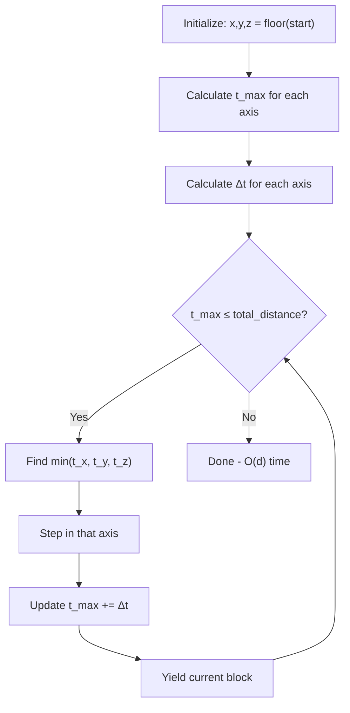
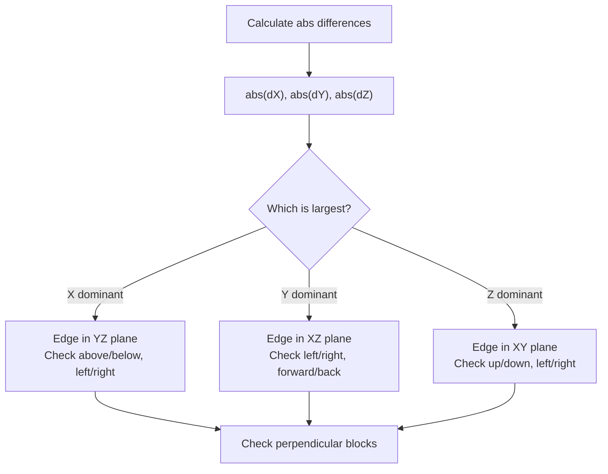
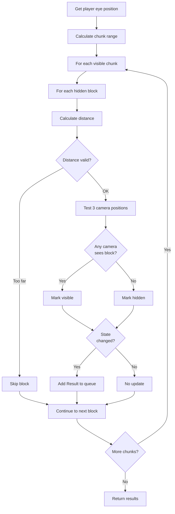
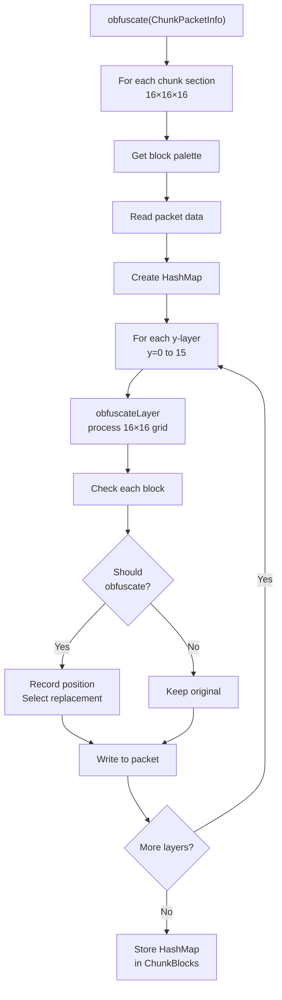
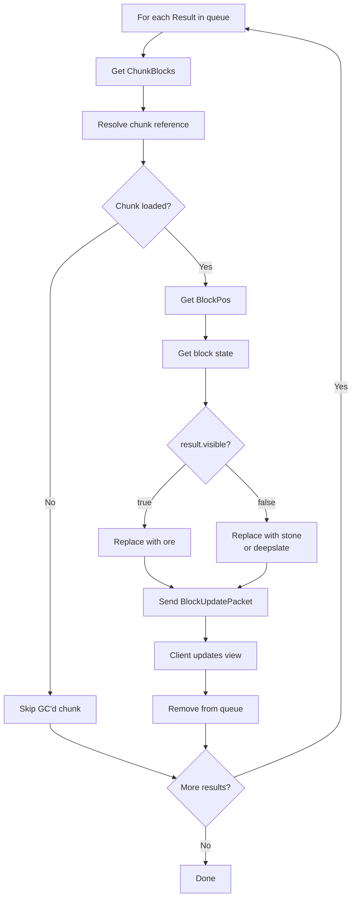
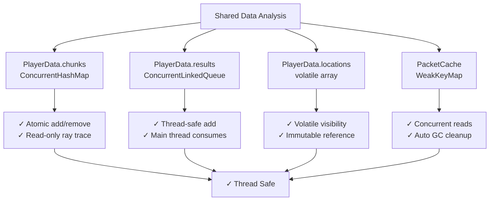
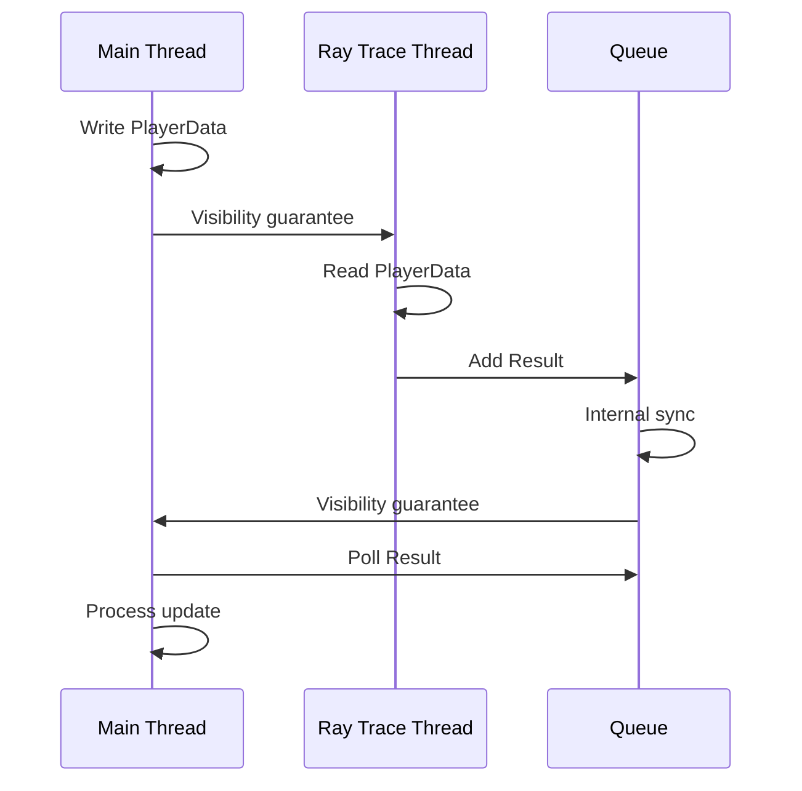

# RayTraceAntiXray - Algorithms & Mathematics

## Digital Differential Analyzer (DDA) Algorithm

### Overview

The **BlockIterator** implements the DDA algorithm for efficient 3D ray traversal through a voxel grid.

**Reference:** Amanatides & Woo (1987) - "A Fast Voxel Traversal Algorithm for Ray Tracing"
**File:** [BlockIterator.java](RayTraceAntiXray/src/main/java/com/vanillage/raytraceantixray/util/BlockIterator.java)

### Mathematical Foundation

#### Ray Parameterization

```
Ray equation:
P(t) = Start + t * Direction

Where:
  P(t) = point on ray at parameter t
  Start = (sx, sy, sz) = starting position
  Direction = (dx, dy, dz) = ray direction (normalized)
  t = parameter (0 = start, 1 = end)

For block traversal:
  P(t) = (sx + t*dx, sy + t*dy, sz + t*dz)
```

#### Grid Crossing Detection

```
Find when ray crosses grid lines:

For X-axis crossing:
  x_grid = floor(sx) + 0.5 + step_x*0.5
  (sx + t*dx) = x_grid
  t_x = (x_grid - sx) / dx

Similarly for Y and Z axes:
  t_y = (y_grid - sy) / dy
  t_z = (z_grid - sz) / dz

Delta-t (distance between consecutive crossings):
  Δt_x = 1 / |dx|
  Δt_y = 1 / |dy|
  Δt_z = 1 / |dz|
```

#### Traversal Loop



**Complexity:** O(d) time, O(1) space (d = distance in blocks)

### Implementation Details

**File:** [BlockIterator.java](RayTraceAntiXray/src/main/java/com/vanillage/raytraceantixray/util/BlockIterator.java#L40)

```java
// Constructor: Initialize from start and end positions
BlockIterator(double startX, double startY, double startZ,
              double endX, double endY, double endZ)

// Constructor: Initialize with direction and distance
BlockIterator(double startX, double startY, double startZ,
              double directionX, double directionY, double directionZ,
              double distance)

// Main loop method
int[] calculateNext()
  Returns: [x, y, z] or null if done

// Iterator interface
boolean hasNext()
int[] next()
```

### Performance Characteristics

```
Advantages:
✓ O(n) time complexity (linear in distance)
✓ O(1) space complexity
✓ Single pass traversal
✓ Cache-efficient (linear memory access)
✓ No floating-point arithmetic in main loop
✓ Handles all octants naturally

Disadvantages:
✗ Cannot easily skip empty regions
✗ Must visit every block along ray

Use Case:
- Very efficient for ray tracing through voxel grids
- Standard algorithm in game engines
- Ideal for block visibility testing
```

---

## Block Occlusion Culling Algorithm

### Overview

Tests if a ray from camera to block is occluded by solid blocks in the environment.

**File:** [BlockOcclusionCulling.java](RayTraceAntiXray/src/main/java/com/vanillage/raytraceantixray/util/BlockOcclusionCulling.java)

### Algorithm

```
isVisible(blockPos, cameraPos, cameraDir):
  1. Calculate vector from block to camera
  2. Check frustum: is block behind camera view?
     IF behind: RETURN false (not visible)
  3. Create ray from block center toward camera
  4. Traverse ray using BlockIterator
  5. For each block along ray:
     IF block is SOLID:
       a. Check nearby blocks in perpendicular plane
       b. Calculate edge intersection
       c. IF edge partially visible: RETURN true
       d. ELSE: block fully occluded
     ELSE: continue to next block
  6. Reached camera without full occlusion
     RETURN true (visible)
```

### Edge Case Handling

**Problem:** A block at integer coordinates might not fully occlude the line of sight if the ray passes near an edge.

**Solution:** Test nearby blocks in perpendicular plane to ray

```
Example (2D visualization):
Camera looking at block:

  Camera
    ↑
    |      [Solid Block]
    | ***  ┌─────────────┐
    |   ↗ /│             │
    |  ◀──X──────────────│  Block Center
    |   ↖ \│             │
    | ***  └─────────────┘
    |      [Nearby Blocks]
    
The * shows ray path near edge
Need to check if any nearby blocks also block
```

#### Edge Detection



#### Visibility Determination

```
For each perpendicular direction:
1. Check if nearby block also occludes ray
2. If any perpendicular direction is NOT occluded: visible
3. If all perpendicular directions are occluded: not visible

This allows partial visibility at block edges
```

---

## Ray Tracing Algorithm

### Overview

Determines which ore blocks are visible to the player and updates visibility state.

**File:** [RayTraceCallable.java](RayTraceAntiXray/src/main/java/com/vanillage/raytraceantixray/tasks/RayTraceCallable.java)

### Algorithm Flow



### Key Features

#### Multiple Camera Positions

```java
// Three camera positions for third-person viewing:
locations[0] = First-person (eye position, looking forward)
locations[1] = Third-person front (4 blocks behind, reversed direction)
locations[2] = Third-person back (4 blocks forward, same direction)

// Calculation:
thirdPersonFront = eyePosition - 4 * direction
thirdPersonBack = eyePosition + 4 * direction
```

#### Distance Checks

```
rayTraceDistance: 120.0 blocks
  - Only trace blocks within this distance
  - Saves computation for distant blocks
  - Configurable per world

rehideDistance: infinity (or lower value)
  - If block distance >= rehideDistance: skip visibility test
  - Never re-hide blocks beyond this distance
  - Reduces re-hiding overhead
```

#### Visibility State Caching

```
ChunkBlocks.blocks map:
  Key: BlockPos
  Value: Boolean
    true = block is hidden (should be stone)
    false = block is visible (should be ore)

Update logic:
  IF new_state != previous_state:
    Add Result to queue (for main thread processing)
    Update cache with new state
```

### Time Complexity

```
Per ray trace iteration:
  For each chunk: O(1) - constant chunk count
  For each block: O(n) where n = visible blocks per chunk
  Visibility test: O(d + e) where d = distance, e = edge cases
  
Total: O(n * d) where n = blocks, d = ray distance

Optimization: Only trace loaded chunks near player
  Visible chunks ≈ (rayTraceDistance / 16)² 
  Typical: 64 chunks visible at 120 block distance
```

---

## Chunk Obfuscation Algorithm

### Overview

Hides ore blocks in chunk packets by replacing with stone/deepslate, while recording which blocks were hidden for ray tracing.

**File:** [ChunkPacketBlockControllerAntiXray.java](RayTraceAntiXray/src/main/java/com/vanillage/raytraceantixray/antixray/ChunkPacketBlockControllerAntiXray.java#L350)

### obfuscate() Method



### obfuscateLayer() Method

**Purpose:** Process one horizontal slice of blocks (16×16)

```
FOR each block in 16×16 grid at y-level:
  1. Read original block state
  2. Check if block should be obfuscated:
     a. Check if it's in obfuscateGlobal[] array
     b. Check if it has solid neighbors (air exposure)
  3. IF should obfuscate:
     a. Record block position in HashMap
     b. Select random replacement block
     c. Write replacement to packet data
  4. IF block has tile entity:
     a. Update block entity coordinates
```

### Hidden Block Selection

```
A block is marked as "hidden" if:
1. Block is in obfuscateGlobal[] (Paper's hidden list or custom)
2. AND block is exposed to air (has transparent neighbor in any direction)
3. AND block position is below maxBlockHeight
4. AND count < maxRayTraceBlockCountPerChunk

Transparency check:
  For each of 6 neighbors (±x, ±y, ±z):
    Check if neighbor is transparent (air, glass, etc.)
    If any neighbor is transparent: block is exposed
```

### Replacement Block Selection

```
Engine Mode: HIDE (engine-mode: 1)
  Select based on world type:
  - NORMAL: Stone (y < 0) or Deepslate (y >= 0)
  - NETHER: Netherrack
  - THE_END: End Stone

Engine Mode: OBFUSCATE (engine-mode: 2 or 3)
  Select from preset blocks:
  - Random selection each layer
  - More variety, less realistic
```

### Block Entity Handling

```
Block entities (chests, dispensers, etc.):

1. Obfuscated blocks cannot have tile entities
   - Paper config auto-filters these out
2. Block entities are tracked separately
3. Coordinates must be updated if block position changes
4. Use reflection to access BlockEntityInfo fields
```

### Space Complexity

```
Thread-local arrays per worker thread:
- SOLID[blockStateCount]        ≈ 20KB
- OBFUSCATE[blockStateCount]    ≈ 20KB
- TRACE[blockStateCount]        ≈ 20KB
- BLOCK_ENTITY[blockStateCount] ≈ 20KB
- CURRENT[16][16]               ≈ 512 bytes
- NEXT[16][16]                  ≈ 512 bytes
- NEXT_NEXT[16][16]             ≈ 512 bytes
- TRACE_CACHE[16][16]           ≈ 512 bytes
- BLOCK_ENTITY_CACHE[16][16]    ≈ 512 bytes

Per-chunk:
- HashMap<BlockPos, Boolean>: 8 bytes * count
  Typical: 100 entries = 800 bytes
```

---

## Result Application Algorithm

### Overview

Takes ray tracing results and updates chunk packets sent to clients.

**File:** [UpdateBukkitRunnable.java](RayTraceAntiXray/src/main/java/com/vanillage/raytraceantixray/tasks/UpdateBukkitRunnable.java)

### Algorithm



### Packet Update Mechanism

```
BlockPos → ClientboundBlockUpdatePacket

Contains:
- Block position (x, y, z)
- New block state
- Send to specific player

Client receives:
- Updates local block state
- Renders new block immediately
- No chunk reload needed
```

---

## Visibility Calculation Mathematics

### Vector Mathematics

```
Block visibility test:

Vector from block to camera:
  diff = camera_pos - block_center
  diff = (camera_x - block_x + 0.5,
          camera_y - block_y + 0.5,
          camera_z - block_z + 0.5)

Distance (squared):
  dist² = diff · diff = diff.x² + diff.y² + diff.z²

Distance (actual):
  dist = √(dist²)

Normalized direction:
  direction = diff / dist
```

### Frustum Culling

```
Simplified frustum check (behind camera view):

Camera looking in direction D:

IF dot((block - camera), D) < -45°:
  Block is behind camera (approximately)
  Return false (not visible)

Full check:
  viewport_normal = D
  block_offset = block - camera
  angle = atan2(|block_offset × D|, block_offset · D)
  
  IF angle > field_of_view / 2:
    Block outside view cone
    Return false
```

### Occlusion Testing

```
Ray from block center to camera:

Start = block_center
End = camera_pos
Direction = (camera_pos - block_center) / distance

For each solid block B along ray:
  1. Check if B fully blocks ray
  2. If edge is visible: ray gets through
  3. If fully blocked: return false
  
Return true if ray reaches camera
```

---

## Optimization Techniques

### 1. Block Iterator Caching

```java
// Reuse BlockIterator instance:
BlockIterator iterator = new BlockIterator(...);
iterator.initialize(...);  // Reset with new parameters

Benefit:
- Avoid allocation overhead
- Reuse internal state
- Thread-local cache
```

### 2. Cached Section Block Occlusion

```java
CachedSectionBlockOcclusionGetter:
  - Cache current chunk/section
  - Avoid repeated lookups
  - Fast solid block checking
  
Cache invalidation:
  - When x/z chunk changes
  - When y section changes
```

### 3. Thread-Local Arrays

```java
ThreadLocal<boolean[]> SOLID = ThreadLocal.withInitial(...)
  - Each thread has own array
  - No synchronization needed
  - CPU cache locality

Benefit:
- 0 lock contention
- Fast memory access
- No false sharing
```

### 4. Weak Reference Cache

```java
MapMaker().weakKeys()
  - Keys are ClientboundLevelChunkWithLightPacket
  - When packet is sent, weak key is eligible for GC
  - Cache automatically cleaned up
  
Benefit:
- No manual cleanup
- Memory safe
- Simple API
```

### 5. Result Queue Batching

```
Results accumulate in concurrent queue:
  Queue<Result> results = new ConcurrentLinkedQueue()
  
Batching:
  Main thread polls all available results per tick
  Not one-per-tick
  Reduces main thread contention
```

---

## Numerical Precision & Edge Cases

### Floating Point Issues

```
DDA algorithm handles edge cases:

1. Zero direction component:
   tDelta = ∞ (never crosses that axis)
   handled by Double.POSITIVE_INFINITY

2. Very small direction component:
   tDelta ≈ ∞ (practical infinity)
   still correct, just never reached

3. Ray exactly on grid line:
   Handled by careful rounding in initialization
```

### Block Boundary Precision

```
Block boundaries:
  Floor block at (x, y, z):
  - X ranges from x to x+1
  - Y ranges from y to y+1
  - Z ranges from z to z+1

Center:
  (x + 0.5, y + 0.5, z + 0.5)

Grid crossing:
  Ray crosses boundary when coordinate passes integer
```

---

## Concurrency Guarantees

### Thread Safety Analysis



### Memory Visibility



---

## Performance Analysis

### Ray Tracing Cost

```
Per player per tick:

Setup: O(1)
  - Get locations
  - Get chunks

Chunk iteration: O(C)
  - C = visible chunks ≈ 64 (at 120 blocks)
  - Each chunk check O(1)

Block iteration: O(B)
  - B = visible blocks (∝ radius²)
  - Typical: 100-500 blocks per chunk
  - Total blocks: 6,400-32,000 per tick

Visibility test: O(D + E)
  - D = ray distance ≈ 120 blocks
  - E = edge tests ≈ 3-6 blocks
  - Total distance: 1,000-10,000 block checks

Total per tick: O(B * D) ≈ 100,000-300,000 block tests
For 20 players: 2,000,000-6,000,000 tests/tick

Optimization:
- Distance limits reduce this significantly
- Parallelization across threads
- Early exit for visible/hidden blocks
```

### Memory Footprint

```
Per player:
  - PlayerData: ≈ 500 bytes
  - Chunks map: ≈ 10KB (64 entries)
  - Locations: ≈ 100 bytes
  - Results queue: ≈ varies (10KB typical)
  - Packet handler: ≈ 500 bytes
  Total: ≈ 20KB per player

Per chunk:
  - ChunkBlocks wrapper: ≈ 100 bytes
  - Blocks map: ≈ 8 bytes * block_count
  - Typical: ≈ 1KB per chunk

Per thread:
  - ThreadLocal arrays: ≈ 150KB
  - Multiple threads × this cost

For server with 20 players, 2 threads:
  Players: 20 × 20KB = 400KB
  Chunks: 1,280 × 1KB = 1.3MB (64 chunks × 20 players)
  Threads: 2 × 150KB = 300KB
  Total: ≈ 2MB
```

