# RayTraceAntiXray Plugin - Comprehensive Architecture Documentation

## Overview

**RayTraceAntiXray** is a Paper Spigot plugin that enhances anti-xray protection by using server-side ray tracing to selectively reveal or hide ore blocks based on player visibility. It integrates with Paper's native Anti-Xray engine (engine-mode 1) and adds intelligent block visibility calculation using 3D ray tracing algorithms.

### Key Purpose
- Prevent X-ray clients from finding hidden ores by intelligently revealing only ores the player can actually see
- Use async multi-threaded ray tracing to calculate visibility without blocking the main server thread
- Support both first-person and third-person camera modes

---

## Plugin Information

### Basic Details
- **Name:** RayTraceAntiXray
- **Version:** 1.17.5
- **API Version:** 1.21.11
- **Main Class:** [com.vanillage.raytraceantixray.RayTraceAntiXray](RayTraceAntiXray/src/main/java/com/vanillage/raytraceantixray/RayTraceAntiXray.java)
- **Load Stage:** STARTUP
- **Folia Compatibility:** Yes (Async-safe)

### Permissions & Commands

```yaml
Permissions:
  raytraceantixray.command.raytraceantixray:
    - Allows access to main command
  raytraceantixray.command.raytraceantixray.timings:
    - Allows toggling performance timings
  raytraceantixray.command.raytraceantixray.timings.on:
    - Allows enabling timings
  raytraceantixray.command.raytraceantixray.timings.off:
    - Allows disabling timings
  raytraceantixray.command.reload:
    - Allows reloading plugin configuration
  raytraceantixray.command.reloadchunks:
    - Allows reloading chunks for specific players
  paper.antixray.bypass:
    - Bypass anti-xray checks (Paper native)

Command: /raytraceantixray
  - timings <on|off>    # Toggle performance profiling
  - reload              # Reload configuration
  - reloadchunks        # Force chunk reload for player(s)
```

---

## Events Handled

### Bukkit Events

| Event | Priority | File | Purpose |
|-------|----------|------|---------|
| [PlayerJoinEvent](RayTraceAntiXray/src/main/java/com/vanillage/raytraceantixray/listeners/PlayerListener.java#L22) | LOWEST | PlayerListener.java | Initialize player data and packet handler on join |
| [PlayerQuitEvent](RayTraceAntiXray/src/main/java/com/vanillage/raytraceantixray/listeners/PlayerListener.java#L35) | NORMAL | PlayerListener.java | Clean up player data and packet handler on quit |
| [WorldInitEvent](RayTraceAntiXray/src/main/java/com/vanillage/raytraceantixray/listeners/WorldListener.java#L26) | NORMAL | WorldListener.java | Initialize Anti-Xray controller for world |
| [WorldUnloadEvent](RayTraceAntiXray/src/main/java/com/vanillage/raytraceantixray/listeners/WorldListener.java#L30) | NORMAL | WorldListener.java | Restore original Anti-Xray controller on unload |

### Network Events (Packet Interception)

| Packet | File | Handler | Purpose |
|--------|------|---------|---------|
| ClientboundLevelChunkWithLightPacket | [DuplexPacketHandler.java](RayTraceAntiXray/src/main/java/com/vanillage/raytraceantixray/net/DuplexPacketHandler.java) | `handle()` | Intercept chunk data, cache for ray tracing |
| ClientboundForgetLevelChunkPacket | [DuplexPacketHandler.java](RayTraceAntiXray/src/main/java/com/vanillage/raytraceantixray/net/DuplexPacketHandler.java) | `handle()` | Clean up chunk data when chunks unload |
| ClientboundRespawnPacket | [DuplexPacketHandler.java](RayTraceAntiXray/src/main/java/com/vanillage/raytraceantixray/net/DuplexPacketHandler.java) | `handle()` | Clear chunks on respawn |

---

## Core Architecture

### System Architecture Diagram

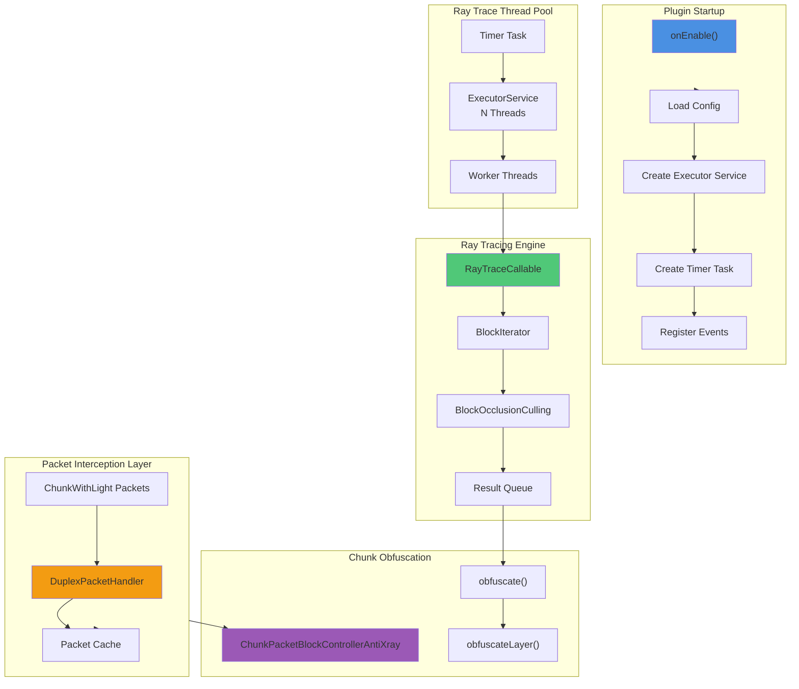

### Component Interaction Flow

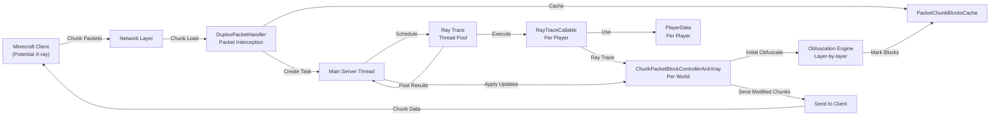

---

## Detailed Component Analysis

### 1. Entry Point: RayTraceAntiXray.java

**File:** [RayTraceAntiXray.java](RayTraceAntiXray/src/main/java/com/vanillage/raytraceantixray/RayTraceAntiXray.java)

#### Lifecycle

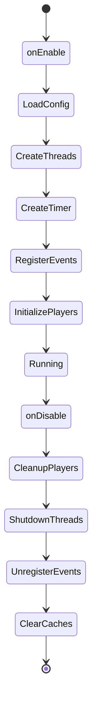

#### Key Fields
- `running: volatile boolean` - Plugin active state
- `timingsEnabled: volatile boolean` - Performance profiling toggle
- `packetChunkBlocksCache: ConcurrentMap<Packet, ChunkBlocks>` - Weak-key cache of chunk data
- `playerData: ConcurrentMap<UUID, PlayerData>` - Per-player ray tracing data
- `executorService: ExecutorService` - Thread pool for ray tracing
- `timer: Timer` - Timer for scheduling ray trace ticks
- `updateTicks: long` - Bukkit runnable schedule period

#### Critical Methods

**`onEnable()`**
```
1. Load/create default configuration
2. Create ExecutorService with N threads (from config)
3. Create Timer for fixed-rate scheduling
4. Register PlayerListener and WorldListener events
5. Initialize all online players
6. Register command executor
```

**`onDisable()`** - Nested try-finally for guaranteed cleanup
```
1. Detach all packet handlers from online players
2. Cancel timer
3. Shutdown executor service (await 1s)
4. Unload all worlds
5. Clear packet cache
6. Clear player data
```

**`createPlayerDataFor(Player player, Location location)`**
```
1. Create new PlayerData with VectorialLocation
2. Create RayTraceCallable for this player
3. If player has existing data: reuse old packet handler
4. Else: create new DuplexPacketHandler and attach to channel
5. Store in playerData map
```

**`getLocations(Entity entity, VectorialLocation location)`**
```
IF ray-trace-third-person enabled:
  1. Create first-person location (eye position)
  2. Create third-person front location (4 blocks behind)
  3. Create third-person back location (4 blocks in front of opposite direction)
  RETURN array of 3 locations
ELSE:
  RETURN array of single first-person location
```

---

### 2. Listener: PlayerListener.java

**File:** [PlayerListener.java](RayTraceAntiXray/src/main/java/com/vanillage/raytraceantixray/listeners/PlayerListener.java)

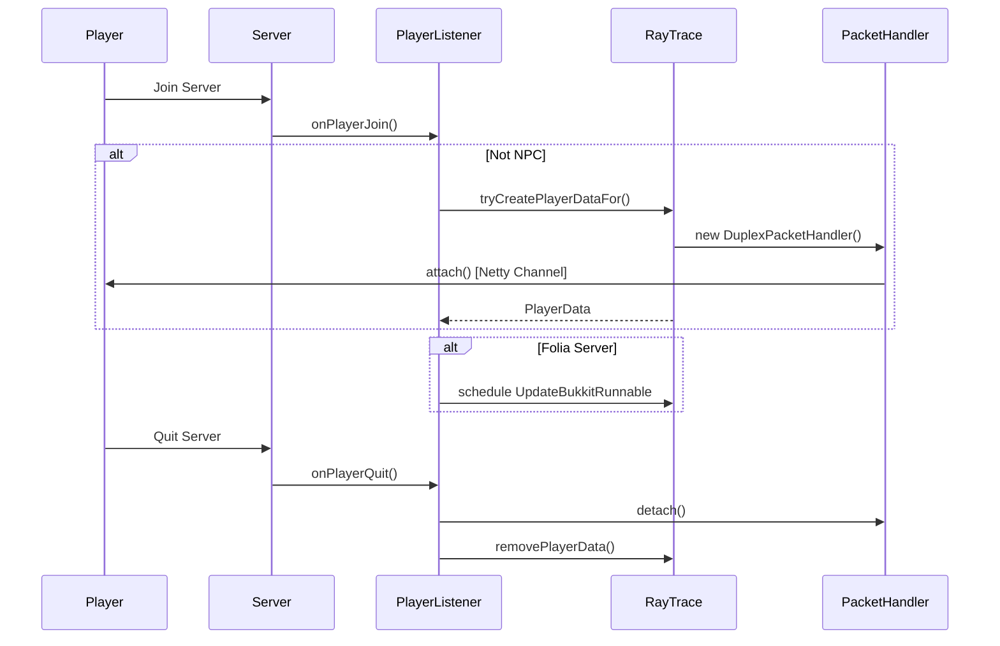

#### Methods

**`@EventHandler(priority = LOWEST) onPlayerJoin(PlayerJoinEvent)`**
- Early handler priority to run before other plugins
- Skip NPC players (checked via metadata)
- Create PlayerData and initialize packet handler
- For Folia: schedule per-player update task
- Catch all exceptions and kick player if error

**`@EventHandler onPlayerQuit(PlayerQuitEvent)`**
- Get PlayerData for leaving player
- Detach packet handler (removes Netty handler)
- Remove from playerData map
- Other cleanup happens in DuplexPacketHandler

---

### 3. Listener: WorldListener.java

**File:** [WorldListener.java](RayTraceAntiXray/src/main/java/com/vanillage/raytraceantixray/listeners/WorldListener.java)

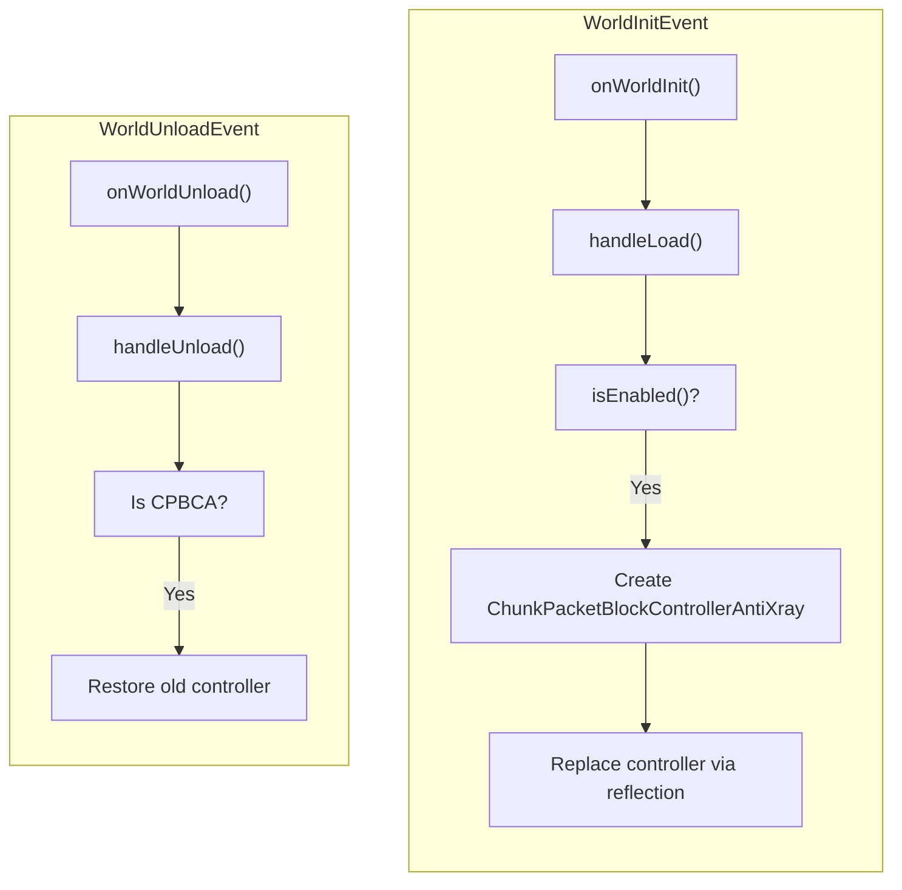

#### Key Method: `handleLoad()`

**Configuration Loading** - Per-world settings with fallback to default:
```yaml
Config Hierarchy:
  world-settings:
    <world_name>:
      anti-xray:
        ray-trace: bool
        ray-trace-third-person: bool
        ray-trace-distance: double
        max-ray-trace-block-count-per-chunk: int
        rehide-blocks: bool
        rehide-distance: double
        ray-trace-blocks: List<String>
        bypass-rehide-blocks: List<String>
    default:
      anti-xray:
        [same settings]
```

**ChunkPacketBlockControllerAntiXray Creation:**
```
- Pass Paper's original controller
- Pass all world-specific settings
- Pass ray-trace-blocks list (blocks to hide/trace)
- Pass bypass-rehide-blocks list (blocks that stay hidden)
- Use MinecraftServer.getServer().executor for async execution
```

**Controller Replacement:**
```
1. Use reflection to access Level.chunkPacketBlockController field
2. Make field accessible
3. Replace with new ChunkPacketBlockControllerAntiXray instance
```

#### Key Method: `handleUnload()`

**Cleanup on world unload:**
```
1. Check if current controller is ChunkPacketBlockControllerAntiXray
2. Get reference to original Paper controller (saved during creation)
3. Restore original controller via reflection
4. Handles exception gracefully
```

---

### 4. Network Handler: DuplexPacketHandler.java

**File:** [DuplexPacketHandler.java](RayTraceAntiXray/src/main/java/com/vanillage/raytraceantixray/net/DuplexPacketHandler.java)

#### Architecture

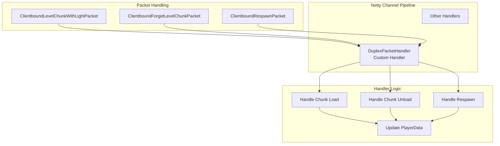

#### Lifecycle: write() Method

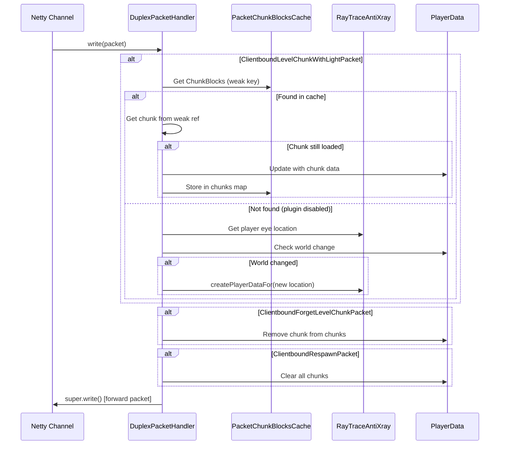

#### Critical Logic: World Change Detection

The handler detects **asynchronous world changes** caused by delayed chunk packets:

```
SCENARIO:
(1) Chunk packet of world A sent
(2) Player changes world to B
(3) Chunk packet of world A arrives (delayed)
(4) Chunk packet of world B arrives

DETECTION:
- When chunk packet arrives, check if chunk's world matches player's current world
- If not: either ignore (plugin disabled in target) or create new PlayerData
- This ensures consistency even with async packet processing
```

---

### 5. Data Container: PlayerData.java

**File:** [PlayerData.java](RayTraceAntiXray/src/main/java/com/vanillage/raytraceantixray/data/PlayerData.java)

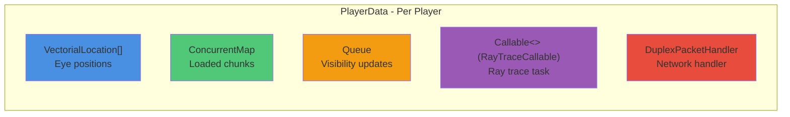

#### Fields

| Field | Type | Purpose |
|-------|------|---------|
| `chunks` | `ConcurrentMap<LongWrapper, ChunkBlocks>` | Track loaded chunks for this player |
| `results` | `Queue<Result>` | Ray tracing results to apply |
| `locations` | `VectorialLocation[]` | Eye positions (1 for first-person, 3 for third-person) |
| `callable` | `Callable<?>` | RayTraceCallable instance for ray tracing |
| `packetHandler` | `DuplexPacketHandler` | Network packet handler |

#### Key Method: `call()`
- Delegates to `callable.call()` (RayTraceCallable)
- Allows PlayerData to be used as a Callable directly
- Executed by timer task on ray trace threads

---

### 6. Ray Trace Engine: RayTraceCallable.java

**File:** [RayTraceCallable.java](RayTraceAntiXray/src/main/java/com/vanillage/raytraceantixray/tasks/RayTraceCallable.java)

#### Architecture

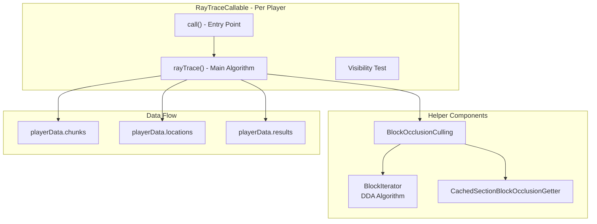

#### Call Flow

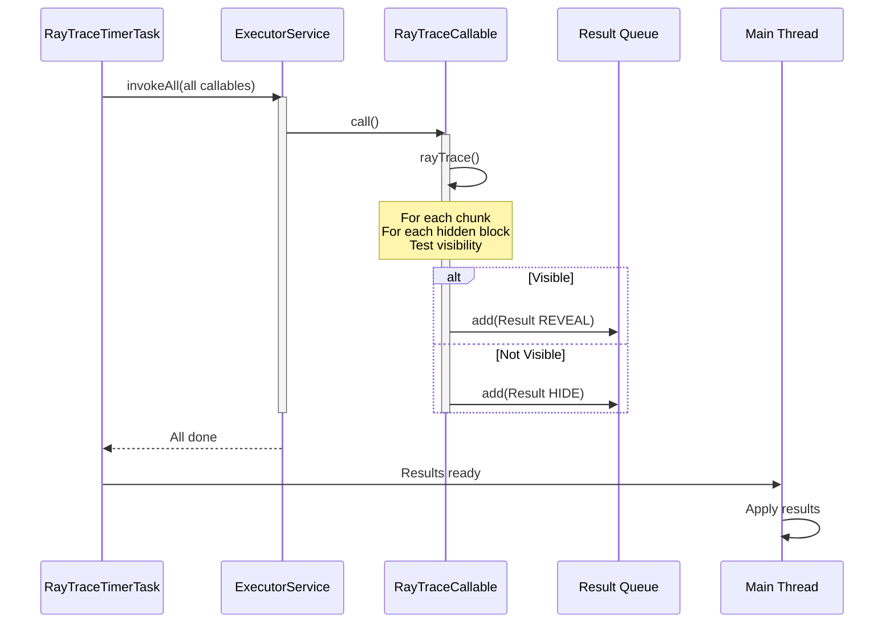

#### Main Algorithm: `rayTrace()`

```
INPUTS:
  - playerData.locations[] (camera positions)
  - playerData.chunks (loaded chunks with hidden blocks)
  - rayTraceDistance (max block distance)
  - rehideDistance (re-hide if beyond this)

ALGORITHM:
1. Calculate visible chunk range based on rayTraceDistance
2. For each loaded chunk in range:
   3. For each hidden block in chunk:
      4. Calculate distance to block
      5. IF distance > rayTraceDistance: skip
      6. IF distance < rehideDistance:
         7. FOR each camera location (1 or 3):
            8. Test visibility with blockOcclusionCulling.isVisible()
            9. IF visible: mark for reveal, break
      10. IF visibility changed: add to results queue
      11. Update block visibility cache

OUTPUTS:
  - Results queue populated with visibility changes
```

#### Visibility Test: `blockOcclusionCulling.isVisible()`

**Input:** Block position, camera position, camera direction
**Output:** boolean (visible or occluded)

```
1. Calculate vector from block center to camera
2. Check frustum (is block behind camera?) 
3. Use BlockIterator to trace ray from block to camera
4. For each block along ray:
   5. Check if it's solid (occludes visibility)
   6. If solid: check nearby blocks for edge cases
   7. If edge block: block is visible
   8. Else: block is occluded
9. Return visibility
```

#### Block Iterator: DDA Algorithm

[BlockIterator.java](RayTraceAntiXray/src/main/java/com/vanillage/raytraceantixray/util/BlockIterator.java) implements the **Digital Differential Analyzer (DDA)** algorithm:

```
REFERENCE: Amanatides & Woo - A Fast Voxel Traversal Algorithm for Ray Tracing
https://en.wikipedia.org/wiki/Digital_differential_analyzer

ALGORITHM:
1. Start at block position (x, y, z)
2. Calculate ray direction components (dx, dy, dz)
3. Calculate step directions: -1 or +1 for each axis
4. Calculate t-values (when ray crosses grid lines)
5. Calculate delta-t (distance between grid crossings)

FOR each step:
  6. Find minimum t-value (which axis crosses next)
  7. Step in that axis
  8. Update t-value for that axis
  9. Return new block position
  10. Repeat until max distance reached

BENEFITS:
- O(n) time complexity where n = number of blocks
- Single pass, no backtracking
- Cache-efficient (linear traversal)
- No floating-point arithmetic after initialization
```

---

### 7. Block Occlusion Culling: BlockOcclusionCulling.java

**File:** [BlockOcclusionCulling.java](RayTraceAntiXray/src/main/java/com/vanillage/raytraceantixray/util/BlockOcclusionCulling.java)

#### Purpose
Test if a ray from camera to block is occluded by solid blocks, accounting for block shapes and edges.

#### Algorithm

```
INPUTS:
  - Block position (x, y, z)
  - Camera position (vector)
  - Ray direction
  - BlockIterator for traversal
  - BlockOcclusionGetter for solid checks

ALGORITHM:
1. For each block along ray (using BlockIterator):
   2. IF block is solid:
      3. Check nearby blocks in perpendicular plane
      4. Calculate edge intersection
      5. IF edge doesn't block: continue (block visible at edge)
      6. ELSE: block is occluded, return false
   7. Continue to next block
8. Reached target without occlusion, return true
```

#### Edge Cases

The algorithm handles **edge occlusion** where a block's edge doesn't fully occlude:

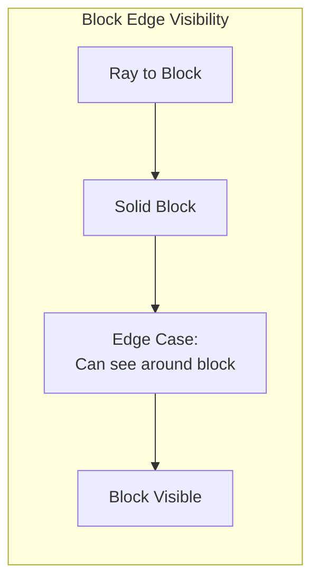

---

### 8. Chunk Obfuscation: ChunkPacketBlockControllerAntiXray.java

**File:** [ChunkPacketBlockControllerAntiXray.java](RayTraceAntiXray/src/main/java/com/vanillage/raytraceantixray/antixray/ChunkPacketBlockControllerAntiXray.java) (1165 lines)

#### Role

Integrates with Paper's Anti-Xray engine to:
1. **Initial Obfuscation:** Hide ore blocks in chunk packets
2. **Ray Trace Integration:** Mark which blocks to ray trace
3. **Dynamic Updates:** Apply ray tracing results to sent packets

#### Architecture

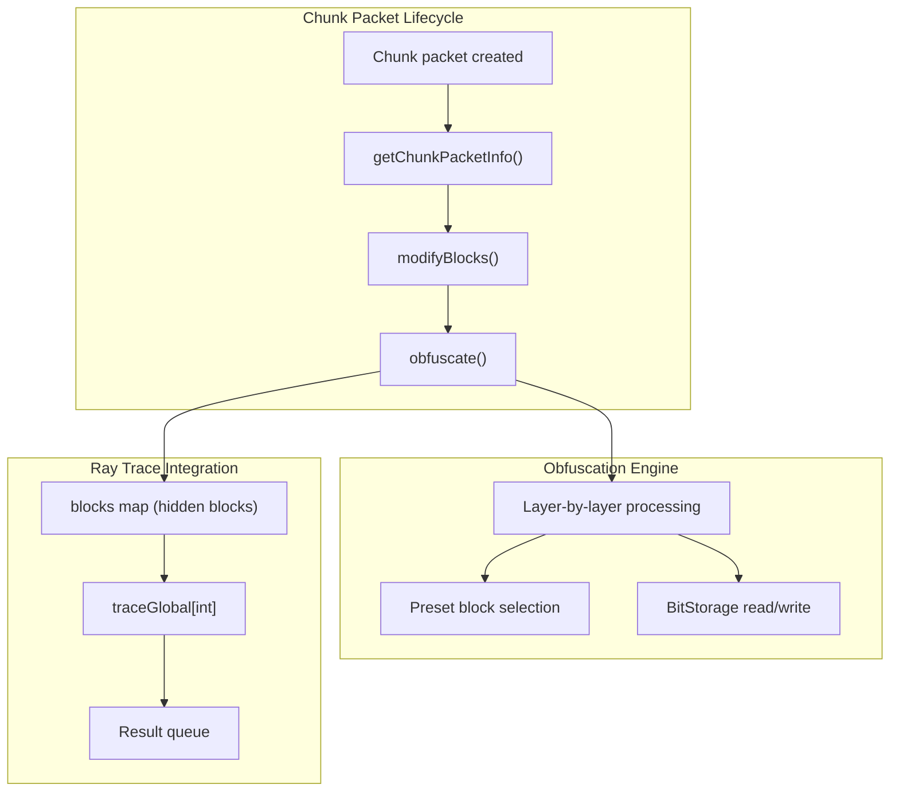

#### Key Methods

**`modifyBlocks(ClientboundLevelChunkWithLightPacket, ChunkPacketInfo)`**

```
1. IF not on primary thread: schedule to region thread
2. Get nearby chunks (for occlusion checking)
3. Submit as async task to executor
4. Calls obfuscate(ChunkPacketInfoAntiXray)
```

**`obfuscate(ChunkPacketInfoAntiXray)`** - Core Algorithm

```
SETUP:
  - Create BitStorageReader/Writer for packet data
  - Initialize thread-local boolean arrays for block properties
  - Get preset blocks (stones, ores, etc.)

FOR each chunk section (16x16x16 blocks):
  1. Read block palette
  2. Create HashMap of blocks to hide
  3. FOR each layer (y = 0 to 15):
     4. Call obfuscateLayer() for each y level
     5. Handles transitions between sections

obfuscateLayer() processes one horizontal slice:
  1. Read original block types from packet
  2. Calculate which blocks should be hidden (solid neighbors + randomization)
  3. Replace hidden blocks with preset stone/deepslate/netherrack/endstone
  4. Record hidden block positions in HashMap
  5. Write modified blocks back to packet

OUTPUT:
  - Packet with ore blocks replaced by stone
  - HashMap<BlockPos, Boolean> of initially hidden blocks
```

#### Block State Arrays

Thread-local arrays tracking block properties:

```java
- solidGlobal[id] : bool - blocks that are solid (not air)
- obfuscateGlobal[id] : bool - blocks to replace with stone (from Paper config)
- traceGlobal[id] : bool - blocks to ray trace (from config ray-trace-blocks)
- blockEntityGlobal[id] : bool - blocks with tile entities
```

#### Engine Modes

```
Paper Anti-Xray Engine Modes:

mode: 1 (HIDE) - Recommended
  - Hide all ores below maxBlockHeight
  - Replace with natural stone blocks
  - This plugin enhances mode 1

mode: 2 (OBFUSCATE_LAYER) 
  - Randomize ore positions per layer
  - Less compatible with ray tracing

mode: 3 (OBFUSCATE_RADIUS)
  - Randomize ore positions per chunk
  - Not recommended for ray tracing
```

---

### 9. Chunk Packet Info: ChunkPacketInfoAntiXray.java

**File:** [ChunkPacketInfoAntiXray.java](RayTraceAntiXray/src/main/java/com/vanillage/raytraceantixray/antixray/ChunkPacketInfoAntiXray.java)

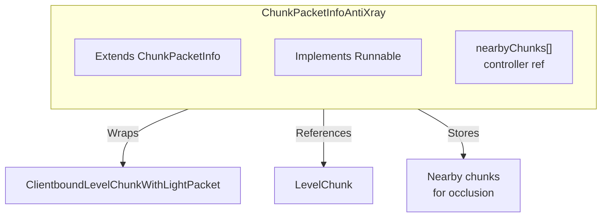

#### Fields
- `nearbyChunks: LevelChunk[]` - 4 adjacent chunks (north, south, east, west)
- `chunkPacketBlockControllerAntiXray: ChunkPacketBlockControllerAntiXray` - Reference to controller

#### run() Method
- Delegates to `chunkPacketBlockControllerAntiXray.obfuscate(this)`
- Called async on executor thread

---

### 10. Ray Trace Scheduling: RayTraceTimerTask.java

**File:** [RayTraceTimerTask.java](RayTraceAntiXray/src/main/java/com/vanillage/raytraceantixray/tasks/RayTraceTimerTask.java)

#### Purpose

Schedule synchronized ray trace ticks at fixed intervals

#### Architecture

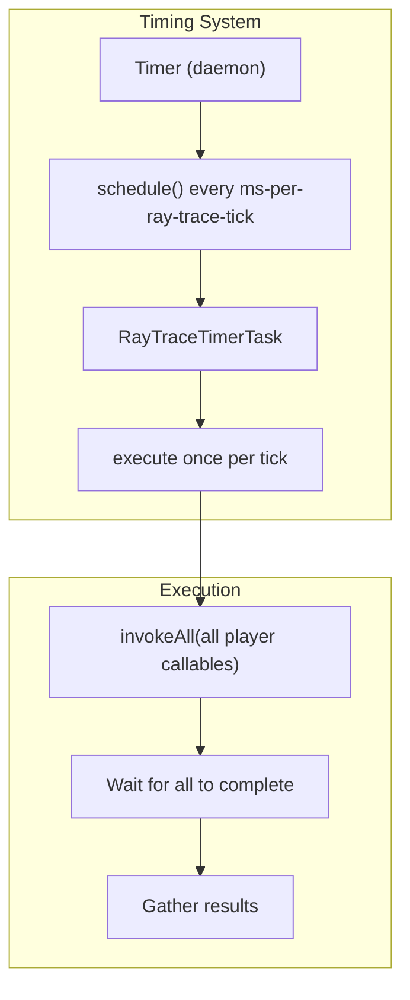

#### run() Method

```java
KEY POINTS:
1. Stopwatch for performance profiling (if timingsEnabled)
2. invokeAll(playerData.values.getCallable())
   - Blocks until ALL ray trace threads complete
   - Ensures tick synchronization
3. Calculate average time per tick
4. Log timing every 1 second (if enabled)
5. Catch exceptions gracefully

THREADING MODEL:
- Timer thread: fixed schedule, no work
- ExecutorService threads: perform actual ray tracing
- invokeAll(): synchronization barrier
```

#### Scheduling Flow

```
INTERVAL:           |--ms-per-ray-trace-tick--|
TIMER:              T1          T2          T3
WORKER THREADS:     [RAYTRACE1] [RAYTRACE2] [RAYTRACE3]
                    [Wait] [Done] [Wait] [Done] [Wait] [Done]
```

---

### 11. Update Scheduler: UpdateBukkitRunnable.java

Schedules result application on main thread (Bukkit-compatible)

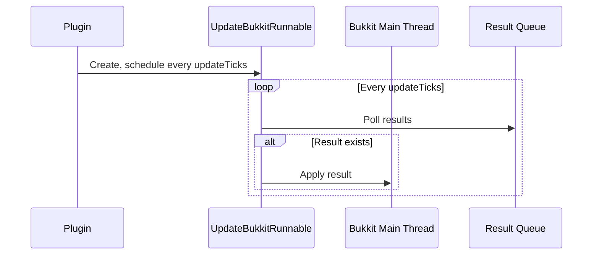

---

### 12. Command Executor: RayTraceAntiXrayTabExecutor.java

**File:** [RayTraceAntiXrayTabExecutor.java](RayTraceAntiXray/src/main/java/com/vanillage/raytraceantixray/commands/RayTraceAntiXrayTabExecutor.java)

#### Commands

```
/raytraceantixray timings on
  - Enable performance profiling to console
  - Shows average time per ray trace tick every second

/raytraceantixray timings off
  - Disable performance profiling

/raytraceantixray reload
  - Reload config.yml without restarting
  - Calls onDisable() then onEnable()

/raytraceantixray reloadchunks [*|player1 player2 ...]
  - Force chunk reload for specified players
  - Removes and re-adds player from chunk loader
  - Causes client to request chunks again
  - * reloads for all online players
```

#### Implementation

```java
onTabComplete(): List<String>
  - Provide completion suggestions
  - Check permissions for each suggestion
  - Handle partial arguments

onCommand(): boolean
  - Execute command with permission checks
  - Return usage message if incorrect syntax
  - Provide detailed help information
```

---

## Configuration System

### config.yml Structure

```yaml
settings:
  anti-xray:
    update-ticks: 2                    # Bukkit tick interval for result application
    ms-per-ray-trace-tick: 50          # Time budget per ray trace iteration
    ray-trace-threads: 2               # Number of worker threads

world-settings:
  default:                             # All worlds inherit these
    anti-xray:
      ray-trace: true                  # Enable/disable ray tracing
      ray-trace-third-person: false    # Trace third-person camera modes
      ray-trace-distance: 120.0        # Max distance to ray trace (blocks)
      max-ray-trace-block-count-per-chunk: 100
      rehide-blocks: false             # Re-hide blocks that leave view
      rehide-distance: .inf            # Distance threshold for re-hiding
      bypass-rehide-blocks: []         # Blocks that stay visible
      ray-trace-blocks: []             # Blocks to trace (empty = Paper's config)
  
  my-world:                            # Per-world overrides
    anti-xray:
      ray-trace: false                 # Disable for specific world
```

### Configuration Loading Hierarchy

```
world-settings:
  <world_name>:
    anti-xray:
      <setting>  ← Check first
  default:
    anti-xray:
      <setting>  ← Fallback
```

### Critical Integration Points

1. **Paper Anti-Xray Config** (server.properties / paper-global.yml)
   ```yaml
   anticheat:
     anti-xray:
       enabled: true
       engine-mode: 1          # HIDE mode (required)
       max-block-height: 64
       update-radius: 2
       hidden-blocks:
         - diamond_ore
         - deepslate_diamond_ore
   ```

2. **Permission Bypass**
   - `paper.antixray.bypass` - Players with this skip obfuscation entirely

---

## Data Structures

### ChunkBlocks.java

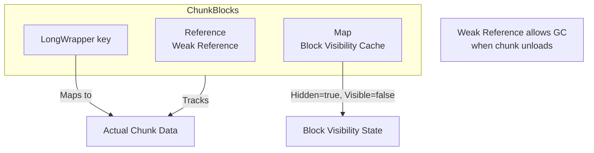

#### Fields
- `chunk: WeakReference<LevelChunk>` - Weak ref (GC when chunk unloads)
- `key: LongWrapper` - ChunkPos as long (x,z coordinates)
- `blocks: Map<BlockPos, Boolean>` - Visibility state cache

### Result.java

```java
public final class Result {
    private final ChunkBlocks chunkBlocks;    // Which chunk
    private final BlockPos block;             // Which block
    private final boolean visible;            // Should reveal (true) or hide (false)
}
```

### VectorialLocation.java

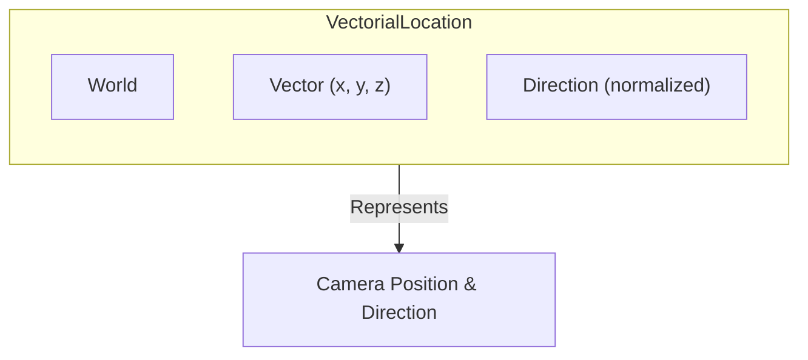

### Wrapper Types

```java
LongWrapper          // ChunkPos as immutable long
MutableLongWrapper   // Mutable for reuse, reduces GC
```

---

## Threading Model

### Thread Architecture

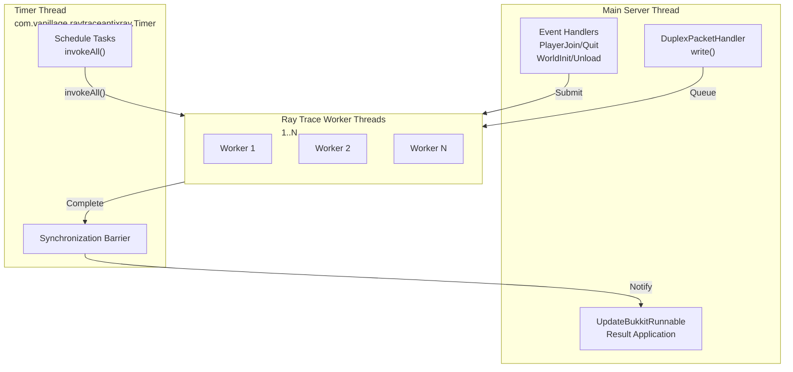

### Synchronization Mechanisms

| Mechanism | Location | Purpose |
|-----------|----------|---------|
| `ConcurrentHashMap` | PlayerData, chunks | Thread-safe data access |
| `ConcurrentLinkedQueue` | Result queue | Lock-free result passing |
| `invokeAll()` | RayTraceTimerTask | Barrier sync for tick completion |
| `volatile` | running, timingsEnabled | Memory visibility flags |
| `WeakReference` | ChunkBlocks.chunk | GC-friendly chunk references |

### Race Condition Mitigation

**World Change During Ray Tracing:**
```
Scenario:
1. Chunk packet from World A queued
2. Player switches to World B
3. Ray trace executes for A
4. Result tries to apply to A's packet

Solution:
- DuplexPacketHandler detects world mismatch
- Doesn't update PlayerData if worlds differ
- Results are safely discarded (no wrong-world updates)
```

**Chunk Unload During Ray Tracing:**
```
Scenario:
1. Ray trace iterates ChunkBlocks
2. Chunk garbage collected
3. WeakReference.get() returns null

Solution:
- Get chunk after iteration check
- null == unloaded: skip processing
- Remove from chunks map automatically
```

---

## Performance Characteristics

### Time Complexity

| Operation | Complexity | Notes |
|-----------|-----------|-------|
| Ray trace per block | O(1) | Fixed-time occlusion test |
| Ray trace per player per chunk | O(N) | N = visible blocks in chunk |
| BlockIterator per ray | O(D) | D = distance to block |
| Block occlusion test | O(D + E) | D = distance, E = edge cases |

### Space Complexity

| Structure | Complexity | Scale |
|-----------|-----------|-------|
| PlayerData per player | O(C) | C = loaded chunks |
| ChunkBlocks.blocks | O(B) | B = max-ray-trace-block-count |
| Thread-local arrays | O(S) | S = block registry size |

### Performance Tuning

```yaml
# For low-end servers:
settings:
  anti-xray:
    ray-trace-threads: 1              # Reduce threads
    ms-per-ray-trace-tick: 100        # Increase time budget
    
world-settings:
  default:
    anti-xray:
      ray-trace-distance: 60.0        # Reduce view distance
      max-ray-trace-block-count-per-chunk: 30
      ray-trace-third-person: false   # Disable third-person

# For high-end servers:
settings:
  anti-xray:
    ray-trace-threads: 4              # More parallelism
    ms-per-ray-trace-tick: 30         # Tighter loop
    
world-settings:
  default:
    anti-xray:
      ray-trace-distance: 150.0
      ray-trace-third-person: true
      max-ray-trace-block-count-per-chunk: 200
```

---

## Integration Points with Paper API

### ChunkPacketBlockController Interface

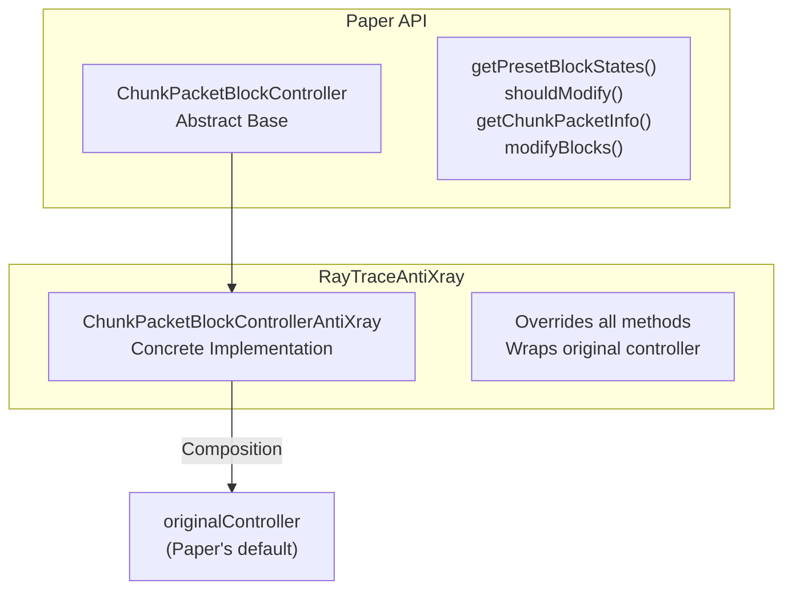

### Reflection Usage

```java
// Required for controller replacement (no API available):
Field field = Level.class.getDeclaredField("chunkPacketBlockController");
field.setAccessible(true);
field.set(serverLevel, newController);
```

### Async Execution

```java
// Paper's region scheduler (Folia compatible):
Bukkit.getRegionScheduler().execute(
    plugin,
    chunk.getLevel().getWorld(),
    x, z,
    () -> modifyBlocks(chunkPacket, chunkPacketInfo)
);
```

---

## Key Files Summary

| File | Lines | Purpose |
|------|-------|---------|
| [RayTraceAntiXray.java](RayTraceAntiXray/src/main/java/com/vanillage/raytraceantixray/RayTraceAntiXray.java) | 359 | Plugin main class, lifecycle management |
| [ChunkPacketBlockControllerAntiXray.java](RayTraceAntiXray/src/main/java/com/vanillage/raytraceantixray/antixray/ChunkPacketBlockControllerAntiXray.java) | 1165 | Core obfuscation engine |
| [RayTraceCallable.java](RayTraceAntiXray/src/main/java/com/vanillage/raytraceantixray/tasks/RayTraceCallable.java) | 413 | Ray tracing algorithm |
| [BlockIterator.java](RayTraceAntiXray/src/main/java/com/vanillage/raytraceantixray/util/BlockIterator.java) | 217 | DDA ray traversal |
| [BlockOcclusionCulling.java](RayTraceAntiXray/src/main/java/com/vanillage/raytraceantixray/util/BlockOcclusionCulling.java) | 239 | Visibility testing |
| [DuplexPacketHandler.java](RayTraceAntiXray/src/main/java/com/vanillage/raytraceantixray/net/DuplexPacketHandler.java) | 143 | Network packet interception |
| [WorldListener.java](RayTraceAntiXray/src/main/java/com/vanillage/raytraceantixray/listeners/WorldListener.java) | ~80 | World initialization |
| [PlayerListener.java](RayTraceAntiXray/src/main/java/com/vanillage/raytraceantixray/listeners/PlayerListener.java) | ~50 | Player join/quit handling |

---

## Configuration Reference

### Complete config.yml

```yaml
# RayTraceAntiXray Configuration
# Paper's Anti-Xray must be enabled with engine-mode: 1

settings:
  anti-xray:
    update-ticks: 2                      # Bukkit ticks between result checks
    ms-per-ray-trace-tick: 50            # Time budget for ray trace loop
    ray-trace-threads: 2                 # Worker threads for ray tracing

world-settings:
  default:
    anti-xray:
      # Core ray tracing settings
      ray-trace: true                    # Enable ray tracing
      ray-trace-third-person: false      # Enable third-person camera trace
      ray-trace-distance: 120.0          # Max block distance to trace
      
      # Block selection
      max-ray-trace-block-count-per-chunk: 100
      ray-trace-blocks: []               # Empty = use Paper's hidden-blocks
      bypass-rehide-blocks: []           # Blocks that never re-hide
      
      # Re-hiding behavior
      rehide-blocks: false               # Hide blocks that leave view
      rehide-distance: .inf              # Distance threshold for re-hiding

  # Example: Disable for specific world
  lobby:
    anti-xray:
      ray-trace: false
```

### Command Usage

```bash
# Toggle performance timings
/raytraceantixray timings on
/raytraceantixray timings off

# Reload configuration
/raytraceantixray reload

# Force chunk reload
/raytraceantixray reloadchunks *
/raytraceantixray reloadchunks player1 player2
```

---

## Summary

**RayTraceAntiXray** is a sophisticated anti-xray enhancement plugin that:

1. **Integrates** with Paper's Anti-Xray engine via `ChunkPacketBlockController`
2. **Intercepts** chunk packets using Netty pipeline handlers
3. **Ray traces** in parallel using DDA algorithm for efficient visibility testing
4. **Updates** dynamically as players move and chunks load/unload
5. **Scales** with configurable thread counts and distance limits
6. **Maintains** thread safety using concurrent collections and synchronization barriers

The architecture balances **performance** (async processing, weak references, cache locality) with **correctness** (race condition handling, graceful cleanup) to provide seamless anti-xray protection without impacting server performance.
