# RayTraceAntiXray - Detailed Flow Diagrams & Sequences

## Complete Startup Sequence

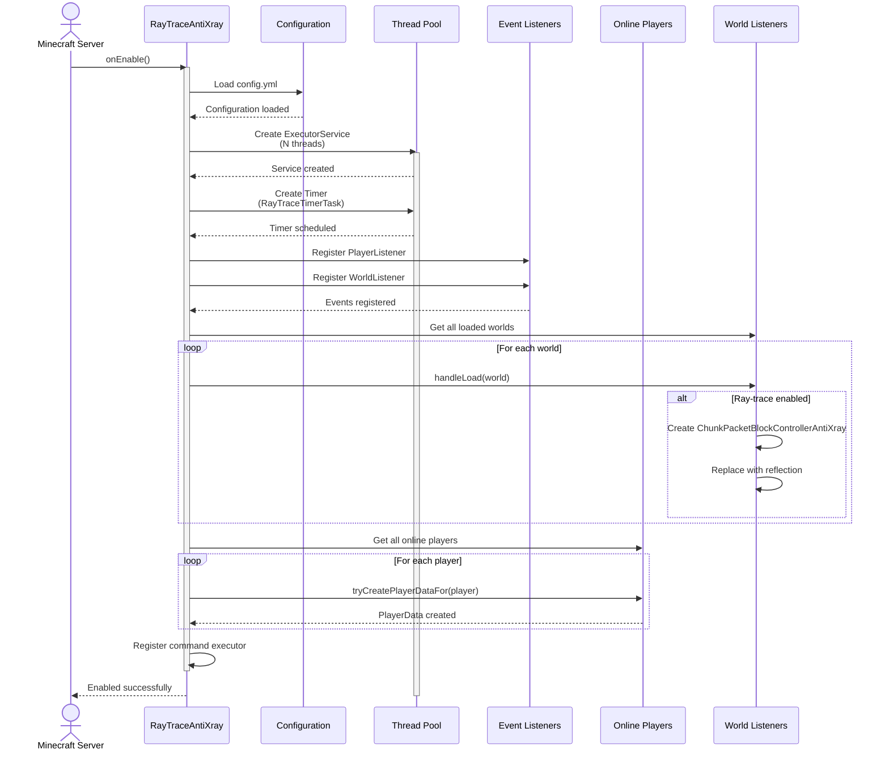
```mermaid
sequenceDiagram
    actor Server as Minecraft Server
    participant Plugin as RayTraceAntiXray
    participant Config as Configuration
    participant Threads as Thread Pool
    participant Events as Event Listeners
    participant Players as Online Players
    participant Worlds as World Listeners

    Server->>Plugin: onEnable()
    activate Plugin
    
    Plugin->>Config: Load config.yml
    Config-->>Plugin: Configuration loaded
    
    Plugin->>Threads: Create ExecutorService<br/>(N threads)
    activate Threads
    Threads-->>Plugin: Service created
    
    Plugin->>Threads: Create Timer<br/>(RayTraceTimerTask)
    Threads-->>Plugin: Timer scheduled
    
    Plugin->>Events: Register PlayerListener
    Plugin->>Events: Register WorldListener
    Events-->>Plugin: Events registered
    
    Plugin->>Worlds: Get all loaded worlds
    loop For each world
        Plugin->>Worlds: handleLoad(world)
        alt Ray-trace enabled
            Worlds->>Worlds: Create ChunkPacketBlockControllerAntiXray
            Worlds->>Worlds: Replace with reflection
        end
    end
    
    Plugin->>Players: Get all online players
    loop For each player
        Plugin->>Players: tryCreatePlayerDataFor(player)
        Players-->>Plugin: PlayerData created
    end
    
    Plugin->>Plugin: Register command executor
    deactivate Plugin
    Plugin-->>Server: Enabled successfully
    deactivate Threads
```

---

## Player Join Flow

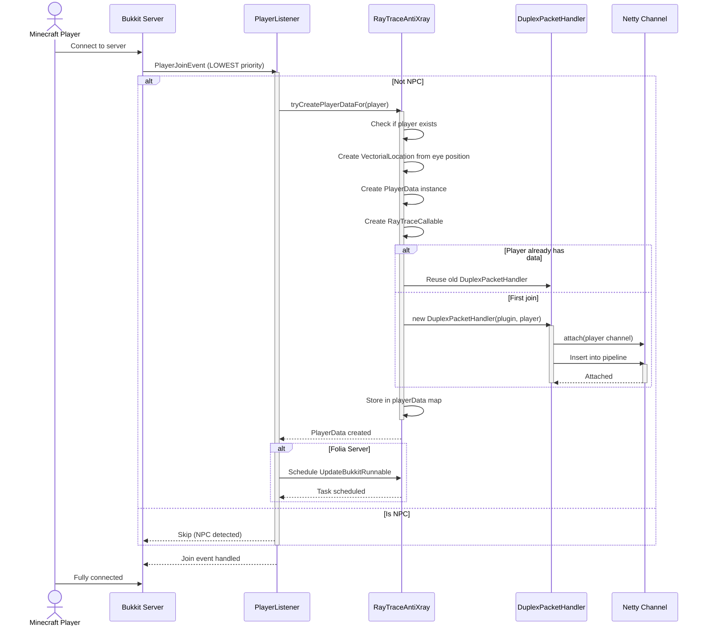
```mermaid
sequenceDiagram
    actor Player as Minecraft Player
    participant Server as Bukkit Server
    participant Listener as PlayerListener
    participant Plugin as RayTraceAntiXray
    participant Handler as DuplexPacketHandler
    participant NettyChannel as Netty Channel

    Player->>Server: Connect to server
    Server->>Listener: PlayerJoinEvent (LOWEST priority)
    activate Listener
    
    alt Not NPC
        Listener->>Plugin: tryCreatePlayerDataFor(player)
        activate Plugin
        
        Plugin->>Plugin: Check if player exists
        Plugin->>Plugin: Create VectorialLocation from eye position
        Plugin->>Plugin: Create PlayerData instance
        Plugin->>Plugin: Create RayTraceCallable
        
        alt Player already has data
            Plugin->>Handler: Reuse old DuplexPacketHandler
        else First join
            Plugin->>Handler: new DuplexPacketHandler(plugin, player)
            activate Handler
            Handler->>NettyChannel: attach(player channel)
            Handler->>NettyChannel: Insert into pipeline
            activate NettyChannel
            NettyChannel-->>Handler: Attached
            deactivate NettyChannel
            deactivate Handler
        end
        
        Plugin->>Plugin: Store in playerData map
        deactivate Plugin
        Plugin-->>Listener: PlayerData created
        
        alt Folia Server
            Listener->>Plugin: Schedule UpdateBukkitRunnable
            Plugin-->>Listener: Task scheduled
        end
    else Is NPC
        Listener-->>Server: Skip (NPC detected)
    end
    
    deactivate Listener
    Listener-->>Server: Join event handled
    Player->>Server: Fully connected
```

---

## Chunk Load & Obfuscation Flow

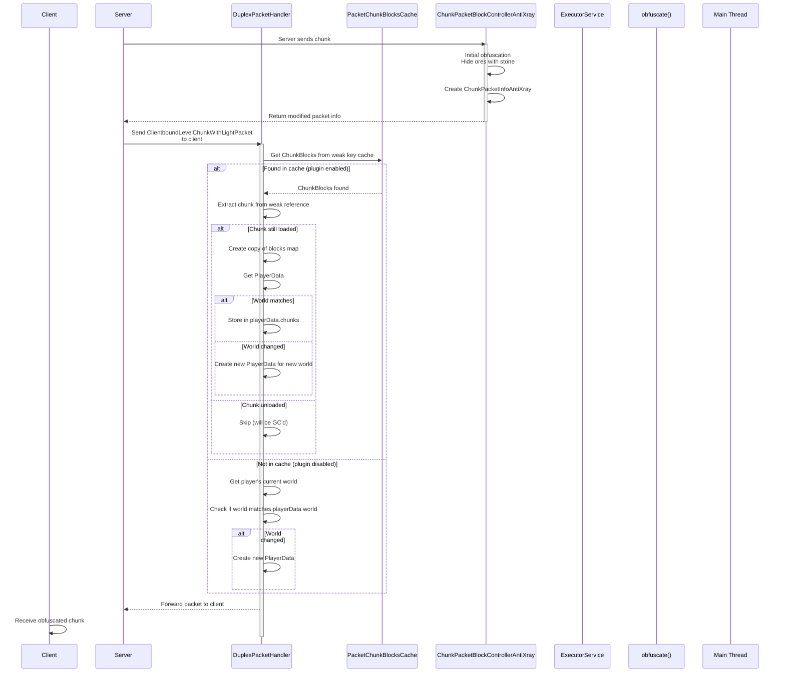
```mermaid
sequenceDiagram
    participant Client as Client
    participant Server as Server
    participant DPH as DuplexPacketHandler
    participant Cache as PacketChunkBlocksCache
    participant CPBCA as ChunkPacketBlockControllerAntiXray
    participant Executor as ExecutorService
    participant Obfuscator as obfuscate()
    participant MainThread as Main Thread

    Server->>CPBCA: Server sends chunk
    activate CPBCA
    
    CPBCA->>CPBCA: Initial obfuscation<br/>Hide ores with stone
    CPBCA->>CPBCA: Create ChunkPacketInfoAntiXray
    CPBCA-->>Server: Return modified packet info
    deactivate CPBCA
    
    Server->>DPH: Send ClientboundLevelChunkWithLightPacket<br/>to client
    activate DPH
    
    DPH->>Cache: Get ChunkBlocks from weak key cache
    
    alt Found in cache (plugin enabled)
        Cache-->>DPH: ChunkBlocks found
        DPH->>DPH: Extract chunk from weak reference
        
        alt Chunk still loaded
            DPH->>DPH: Create copy of blocks map
            DPH->>DPH: Get PlayerData
            
            alt World matches
                DPH->>DPH: Store in playerData.chunks
            else World changed
                DPH->>DPH: Create new PlayerData for new world
            end
        else Chunk unloaded
            DPH->>DPH: Skip (will be GC'd)
        end
    else Not in cache (plugin disabled)
        DPH->>DPH: Get player's current world
        DPH->>DPH: Check if world matches playerData world
        
        alt World changed
            DPH->>DPH: Create new PlayerData
        end
    end
    
    DPH-->>Server: Forward packet to client
    Client->>Client: Receive obfuscated chunk
    deactivate DPH
```

---

## Ray Tracing Execution Cycle

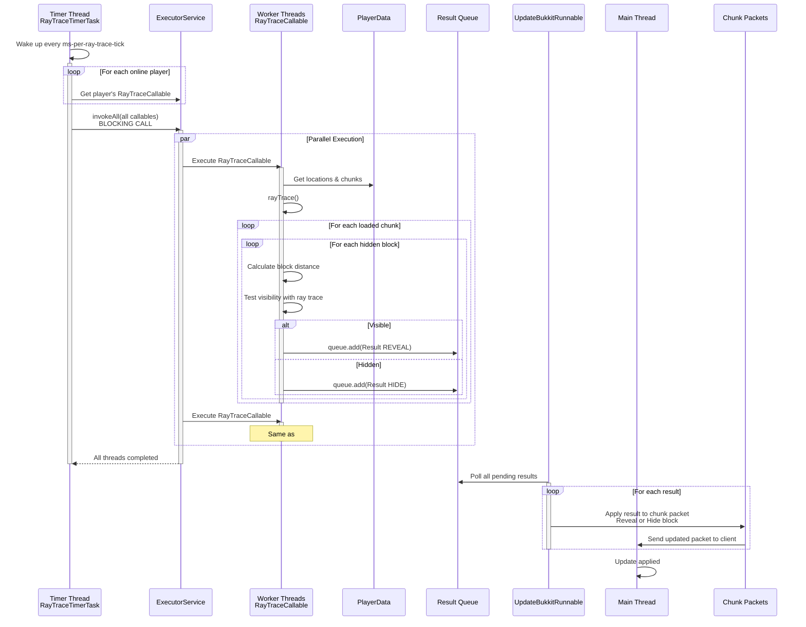
```mermaid
sequenceDiagram
    participant Timer as Timer Thread<br/>RayTraceTimerTask
    participant Executor as ExecutorService
    participant Worker as Worker Threads<br/>RayTraceCallable
    participant PlayerData as PlayerData
    participant Results as Result Queue
    participant UpdateTask as UpdateBukkitRunnable
    participant MainThread as Main Thread
    participant Packets as Chunk Packets

    Timer->>Timer: Wake up every ms-per-ray-trace-tick
    activate Timer
    
    loop For each online player
        Timer->>Executor: Get player's RayTraceCallable
    end
    
    Timer->>Executor: invokeAll(all callables)<br/>BLOCKING CALL
    activate Executor
    
    par Parallel Execution
        Executor->>Worker: Execute RayTraceCallable #1
        activate Worker
        Worker->>PlayerData: Get locations & chunks
        Worker->>Worker: rayTrace()
        
        loop For each loaded chunk
            loop For each hidden block
                Worker->>Worker: Calculate block distance
                Worker->>Worker: Test visibility with ray trace
                
                alt Visible
                    Worker->>Results: queue.add(Result REVEAL)
                else Hidden
                    Worker->>Results: queue.add(Result HIDE)
                end
            end
        end
        
        deactivate Worker
        
        Executor->>Worker: Execute RayTraceCallable #2
        activate Worker
        Note over Worker: Same as #1
        deactivate Worker
    end
    
    Executor-->>Timer: All threads completed
    deactivate Executor
    deactivate Timer
    
    UpdateTask->>Results: Poll all pending results
    activate UpdateTask
    
    loop For each result
        UpdateTask->>Packets: Apply result to chunk packet<br/>Reveal or Hide block
        Packets->>MainThread: Send updated packet to client
    end
    
    deactivate UpdateTask
    MainThread->>MainThread: Update applied
```

---

## Ray Tracing Algorithm - Detailed

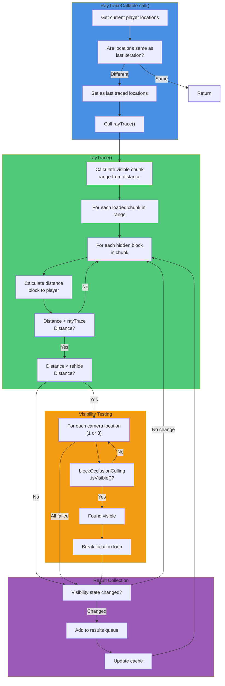
```mermaid
graph TB
    subgraph RayTraceEntry["RayTraceCallable.call()"]
        direction TB
        GetLoc["Get current player locations"]
        CheckEq["Are locations same as<br/>last iteration?"]
        SetLoc["Set as last traced locations"]
        CallRT["Call rayTrace()"]
    end
    
    subgraph RayTraceMain["rayTrace()"]
        direction TB
        CalcRange["Calculate visible chunk<br/>range from distance"]
        ChunkIter["For each loaded chunk in range"]
        BlockIter["For each hidden block<br/>in chunk"]
        CalcDist["Calculate distance<br/>block to player"]
        DistCheck["Distance < rayTrace<br/>Distance?"]
        RehideCheck["Distance < rehide<br/>Distance?"]
    end
    
    subgraph VisibilityTest["Visibility Testing"]
        direction TB
        LocLoop["For each camera location<br/>(1 or 3)"]
        IsVis["blockOcclusionCulling<br/>.isVisible()?"]
        FoundVis["Found visible"]
        Break["Break location loop"]
    end
    
    subgraph ResultQueue["Result Collection"]
        direction TB
        StateChange["Visibility state changed?"]
        AddResult["Add to results queue"]
        UpdateCache["Update cache"]
    end
    
    GetLoc --> CheckEq
    CheckEq -->|Same| Stop["Return"]
    CheckEq -->|Different| SetLoc
    SetLoc --> CallRT
    
    CallRT --> CalcRange
    CalcRange --> ChunkIter
    ChunkIter --> BlockIter
    BlockIter --> CalcDist
    CalcDist --> DistCheck
    DistCheck -->|No| BlockIter
    DistCheck -->|Yes| RehideCheck
    
    RehideCheck -->|No| StateChange
    RehideCheck -->|Yes| LocLoop
    LocLoop --> IsVis
    IsVis -->|Yes| FoundVis
    FoundVis --> Break
    IsVis -->|No| LocLoop
    LocLoop -->|All failed| StateChange
    Break --> StateChange
    
    StateChange -->|No change| BlockIter
    StateChange -->|Changed| AddResult
    AddResult --> UpdateCache
    UpdateCache --> BlockIter
    
    style RayTraceEntry fill:#4a90e2
    style RayTraceMain fill:#50c878
    style VisibilityTest fill:#f39c12
    style ResultQueue fill:#9b59b6
```

---

## Visibility Test Algorithm (Block Occlusion Culling)

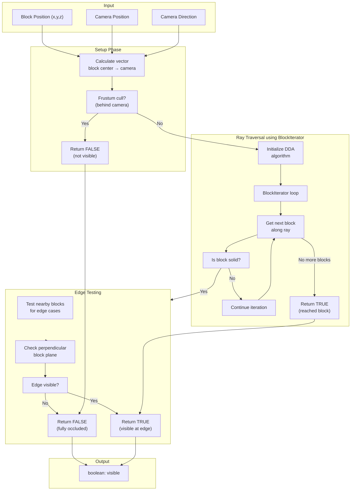
```mermaid
graph TB
    subgraph Input["Input"]
        direction TB
        BlockPos["Block Position (x,y,z)"]
        CamPos["Camera Position"]
        Direction["Camera Direction"]
    end
    
    subgraph Setup["Setup Phase"]
        direction TB
        CalcVec["Calculate vector<br/>block center → camera"]
        CheckFrustum["Frustum cull?<br/>(behind camera)"]
        RetFalse["Return FALSE<br/>(not visible)"]
    end
    
    subgraph RayTraverse["Ray Traversal using BlockIterator"]
        direction TB
        DDAInit["Initialize DDA<br/>algorithm"]
        BlockIter["BlockIterator loop"]
        GetBlock["Get next block<br/>along ray"]
        CheckSolid["Is block solid?"]
        ContinueIter["Continue iteration"]
        RetTrue["Return TRUE<br/>(reached block)"]
    end
    
    subgraph EdgeTest["Edge Testing"]
        direction TB
        EdgeOcclude["Test nearby blocks<br/>for edge cases"]
        EdgeBlocks["Check perpendicular<br/>block plane"]
        EdgeVis["Edge visible?"]
        RetEdgeTrue["Return TRUE<br/>(visible at edge)"]
        RetEdgeFalse["Return FALSE<br/>(fully occluded)"]
    end
    
    subgraph Output["Output"]
        direction TB
        Result["boolean: visible"]
    end
    
    BlockPos --> CalcVec
    CamPos --> CalcVec
    Direction --> CalcVec
    
    CalcVec --> CheckFrustum
    CheckFrustum -->|Yes| RetFalse
    CheckFrustum -->|No| DDAInit
    
    DDAInit --> BlockIter
    BlockIter --> GetBlock
    GetBlock --> CheckSolid
    
    CheckSolid -->|No| ContinueIter
    ContinueIter --> GetBlock
    
    CheckSolid -->|Yes| EdgeTest
    EdgeTest --> EdgeBlocks
    EdgeBlocks --> EdgeVis
    EdgeVis -->|No| RetEdgeFalse
    EdgeVis -->|Yes| RetEdgeTrue
    
    GetBlock -->|No more blocks| RetTrue
    
    RetFalse --> RetEdgeFalse --> Result
    RetTrue --> RetEdgeTrue --> Result
```

---

## Digital Differential Analyzer (DDA) - Block Iterator

```
Theory:
  Reference: Amanatides & Woo (1987)
  "A Fast Voxel Traversal Algorithm for Ray Tracing"

Mathematical Basis:
  Ray: P(t) = start + t * direction
  
  Grid traversal:
  - Start at block (x, y, z)
  - Find where ray crosses each axis
  - Process crossings in order
```

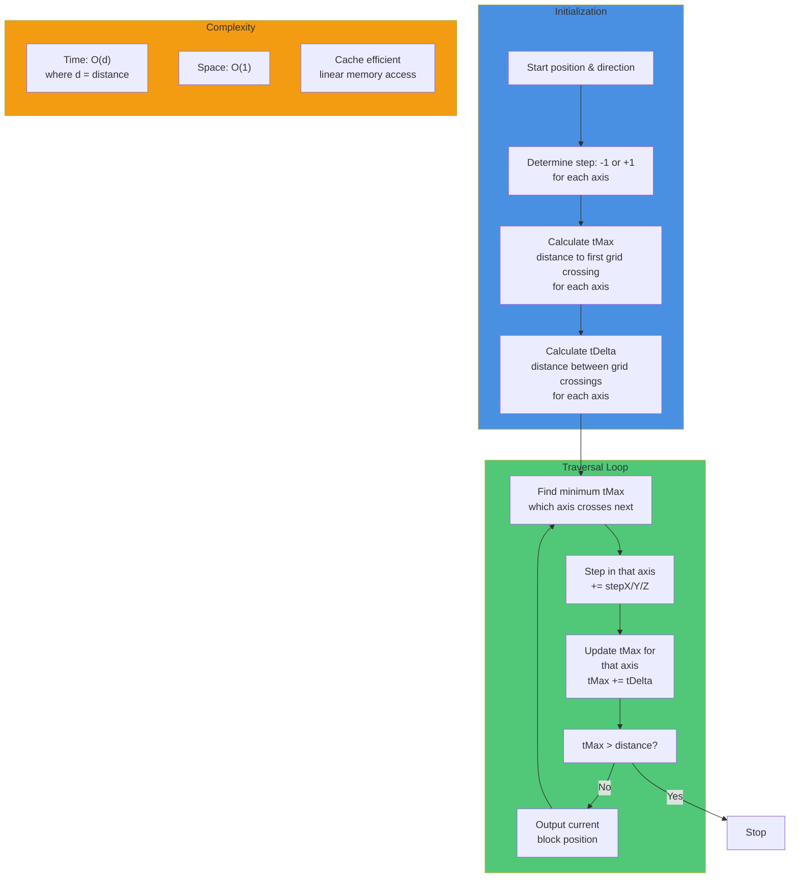
```mermaid
graph TB
    subgraph Setup["Initialization"]
        direction TB
        Start["Start position & direction"]
        Sign["Determine step: -1 or +1<br/>for each axis"]
        TMax["Calculate tMax<br/>distance to first grid crossing<br/>for each axis"]
        TDelta["Calculate tDelta<br/>distance between grid crossings<br/>for each axis"]
    end
    
    subgraph Traverse["Traversal Loop"]
        direction TB
        FindMin["Find minimum tMax<br/>which axis crosses next"]
        Step["Step in that axis<br/>+= stepX/Y/Z"]
        UpdateT["Update tMax for<br/>that axis<br/>tMax += tDelta"]
        Check["tMax > distance?"]
        Output["Output current<br/>block position"]
    end
    
    subgraph Complexity["Complexity"]
        direction TB
        Time["Time: O(d)<br/>where d = distance"]
        Space["Space: O(1)"]
        Cache["Cache efficient<br/>linear memory access"]
    end
    
    Start --> Sign
    Sign --> TMax
    TMax --> TDelta
    TDelta --> FindMin
    
    FindMin --> Step
    Step --> UpdateT
    UpdateT --> Check
    Check -->|No| Output
    Output --> FindMin
    Check -->|Yes| End["Stop"]
    
    style Setup fill:#4a90e2
    style Traverse fill:#50c878
    style Complexity fill:#f39c12
```

---

## Chunk Packet Obfuscation - Layer Processing

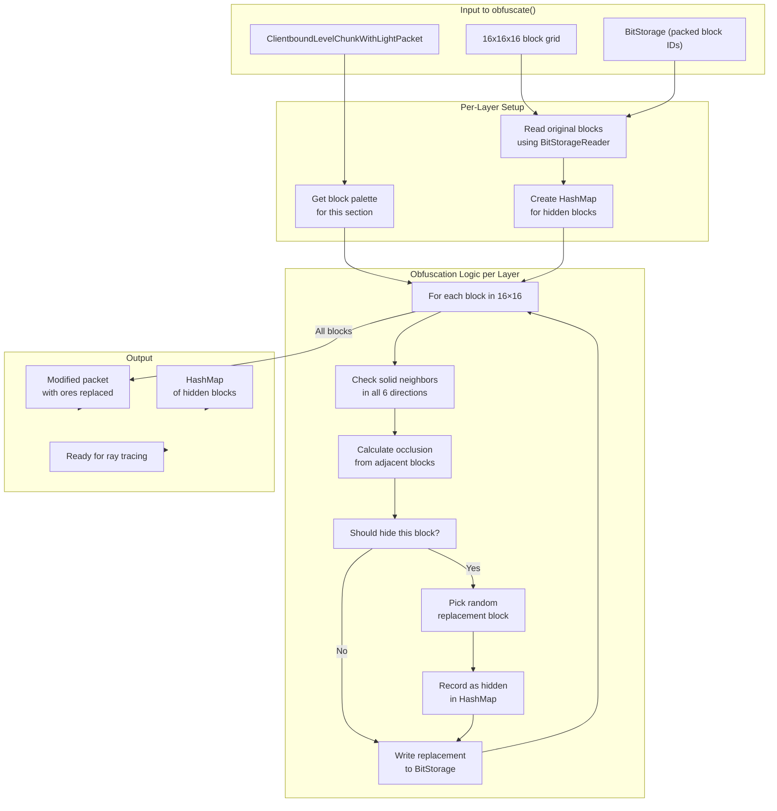
```mermaid
graph TB
    subgraph Input["Input to obfuscate()"]
        direction TB
        Packet["ClientboundLevelChunkWithLightPacket"]
        ChunkData["16x16x16 block grid"]
        BitPacked["BitStorage (packed block IDs)"]
    end
    
    subgraph LayerSetup["Per-Layer Setup"]
        direction TB
        GetPalette["Get block palette<br/>for this section"]
        ReadBlocks["Read original blocks<br/>using BitStorageReader"]
        CreateMap["Create HashMap<br/>for hidden blocks"]
    end
    
    subgraph ObfuscateLogic["Obfuscation Logic per Layer"]
        direction TB
        BlockLoop["For each block in 16×16"]
        CalcNeighbors["Check solid neighbors<br/>in all 6 directions"]
        CalcOcclude["Calculate occlusion<br/>from adjacent blocks"]
        ShouldHide["Should hide this block?"]
        GetRandom["Pick random<br/>replacement block"]
        RecordHidden["Record as hidden<br/>in HashMap"]
        WriteBlock["Write replacement<br/>to BitStorage"]
    end
    
    subgraph Output["Output"]
        direction TB
        ModPacket["Modified packet<br/>with ores replaced"]
        BlockMap["HashMap<BlockPos, Boolean><br/>of hidden blocks"]
        CacheRay["Ready for ray tracing"]
    end
    
    Packet --> GetPalette
    ChunkData --> ReadBlocks
    BitPacked --> ReadBlocks
    
    ReadBlocks --> CreateMap
    GetPalette --> BlockLoop
    CreateMap --> BlockLoop
    
    BlockLoop --> CalcNeighbors
    CalcNeighbors --> CalcOcclude
    CalcOcclude --> ShouldHide
    
    ShouldHide -->|No| WriteBlock
    ShouldHide -->|Yes| GetRandom
    GetRandom --> RecordHidden
    RecordHidden --> WriteBlock
    
    WriteBlock --> BlockLoop
    BlockLoop -->|All blocks| ModPacket
    
    ModPacket --> Output
    BlockMap --> Output
    CacheRay --> Output
```

---

## Player Movement & Location Update

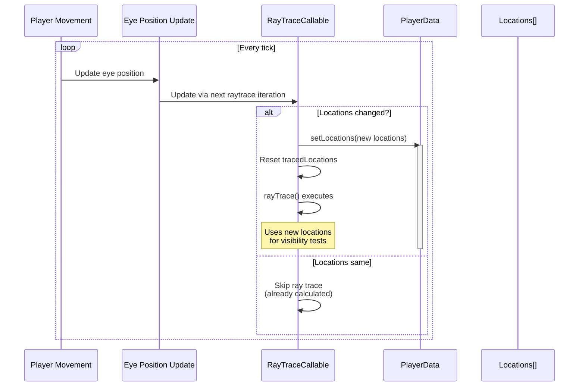
```mermaid
sequenceDiagram
    participant Player as Player Movement
    participant Eye as Eye Position Update
    participant RayTrace as RayTraceCallable
    participant PlayerData as PlayerData
    participant Locations as Locations[]

    loop Every tick
        Player->>Eye: Update eye position
        Eye->>RayTrace: Update via next raytrace iteration
        
        alt Locations changed?
            RayTrace->>PlayerData: setLocations(new locations)
            activate PlayerData
            
            RayTrace->>RayTrace: Reset tracedLocations
            RayTrace->>RayTrace: rayTrace() executes
            
            Note over RayTrace: Uses new locations<br/>for visibility tests
            
            deactivate PlayerData
        else Locations same
            RayTrace->>RayTrace: Skip ray trace<br/>(already calculated)
        end
    end
```

---

## Result Application Flow

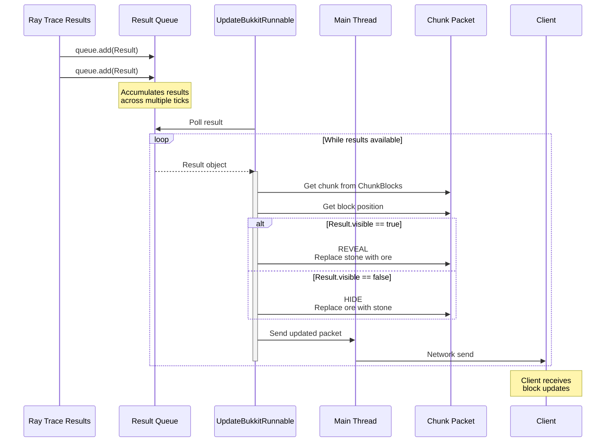
```mermaid
sequenceDiagram
    participant RayTrace as Ray Trace Results
    participant ResultQueue as Result Queue
    participant UpdateTask as UpdateBukkitRunnable
    participant MainThread as Main Thread
    participant ChunkPacket as Chunk Packet
    participant Client as Client

    RayTrace->>ResultQueue: queue.add(Result)
    RayTrace->>ResultQueue: queue.add(Result)
    Note over ResultQueue: Accumulates results<br/>across multiple ticks

    UpdateTask->>ResultQueue: Poll result
    loop While results available
        ResultQueue-->>UpdateTask: Result object
        activate UpdateTask
        
        UpdateTask->>ChunkPacket: Get chunk from ChunkBlocks
        UpdateTask->>ChunkPacket: Get block position
        
        alt Result.visible == true
            UpdateTask->>ChunkPacket: REVEAL<br/>Replace stone with ore
        else Result.visible == false
            UpdateTask->>ChunkPacket: HIDE<br/>Replace ore with stone
        end
        
        UpdateTask->>MainThread: Send updated packet
        MainThread->>Client: Network send
        
        deactivate UpdateTask
    end
    
    Note over Client: Client receives<br/>block updates
```

---

## World Initialization & Controller Replacement

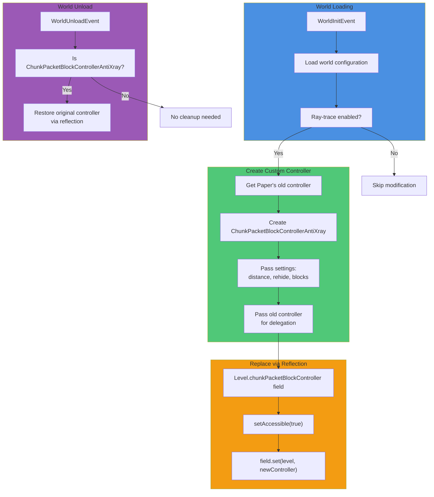
```mermaid
graph TB
    subgraph WorldLoad["World Loading"]
        direction TB
        Event["WorldInitEvent"]
        GetConfig["Load world configuration"]
        Enabled["Ray-trace enabled?"]
    end
    
    subgraph ControllerCreation["Create Custom Controller"]
        direction TB
        GetOld["Get Paper's old controller"]
        CreateNew["Create ChunkPacketBlockControllerAntiXray"]
        Pass["Pass settings:<br/>distance, rehide, blocks"]
        PassOld["Pass old controller<br/>for delegation"]
    end
    
    subgraph Reflection["Replace via Reflection"]
        direction TB
        GetField["Level.chunkPacketBlockController field"]
        SetAccess["setAccessible(true)"]
        Replace["field.set(level, newController)"]
    end
    
    subgraph UnloadCleanup["World Unload"]
        direction TB
        UnloadEvent["WorldUnloadEvent"]
        IsRayTrace["Is ChunkPacketBlockControllerAntiXray?"]
        RestoreOld["Restore original controller<br/>via reflection"]
    end
    
    Event --> GetConfig
    GetConfig --> Enabled
    Enabled -->|Yes| GetOld
    Enabled -->|No| Skip["Skip modification"]
    
    GetOld --> CreateNew
    CreateNew --> Pass
    Pass --> PassOld
    PassOld --> GetField
    GetField --> SetAccess
    SetAccess --> Replace
    
    UnloadEvent --> IsRayTrace
    IsRayTrace -->|Yes| RestoreOld
    IsRayTrace -->|No| Skip2["No cleanup needed"]
    
    style WorldLoad fill:#4a90e2
    style ControllerCreation fill:#50c878
    style Reflection fill:#f39c12
    style UnloadCleanup fill:#9b59b6
```

---

## Permission Checking Flow

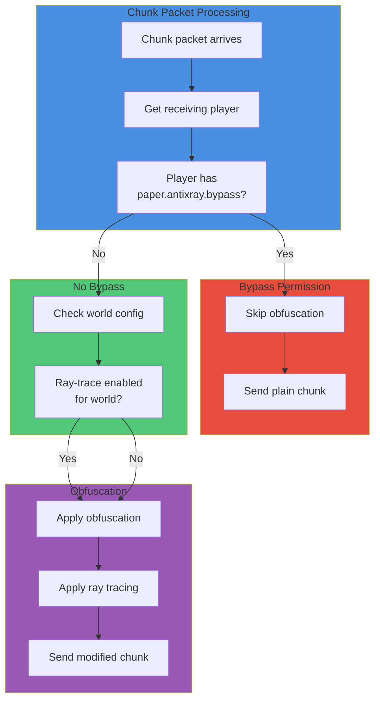
```mermaid
graph TB
    subgraph Initial["Chunk Packet Processing"]
        direction TB
        Arrive["Chunk packet arrives"]
        GetPlayer["Get receiving player"]
        CheckBypass["Player has<br/>paper.antixray.bypass?"]
    end
    
    subgraph WithBypass["Bypass Permission"]
        direction TB
        SkipObf["Skip obfuscation"]
        SendPlain["Send plain chunk"]
    end
    
    subgraph WithoutBypass["No Bypass"]
        direction TB
        GetWorld["Check world config"]
        RayTraceEnabled["Ray-trace enabled<br/>for world?"]
    end
    
    subgraph ObfuscateFlow["Obfuscation"]
        direction TB
        Obfuscate["Apply obfuscation"]
        RayTrace["Apply ray tracing"]
        Send["Send modified chunk"]
    end
    
    Arrive --> GetPlayer
    GetPlayer --> CheckBypass
    
    CheckBypass -->|Yes| SkipObf
    CheckBypass -->|No| GetWorld
    
    SkipObf --> SendPlain
    
    GetWorld --> RayTraceEnabled
    RayTraceEnabled -->|Yes| Obfuscate
    RayTraceEnabled -->|No| Obfuscate
    
    Obfuscate --> RayTrace
    RayTrace --> Send
    
    style Initial fill:#4a90e2
    style WithBypass fill:#e74c3c
    style WithoutBypass fill:#50c878
    style ObfuscateFlow fill:#9b59b6
```

---

## Multi-Threaded Synchronization Model

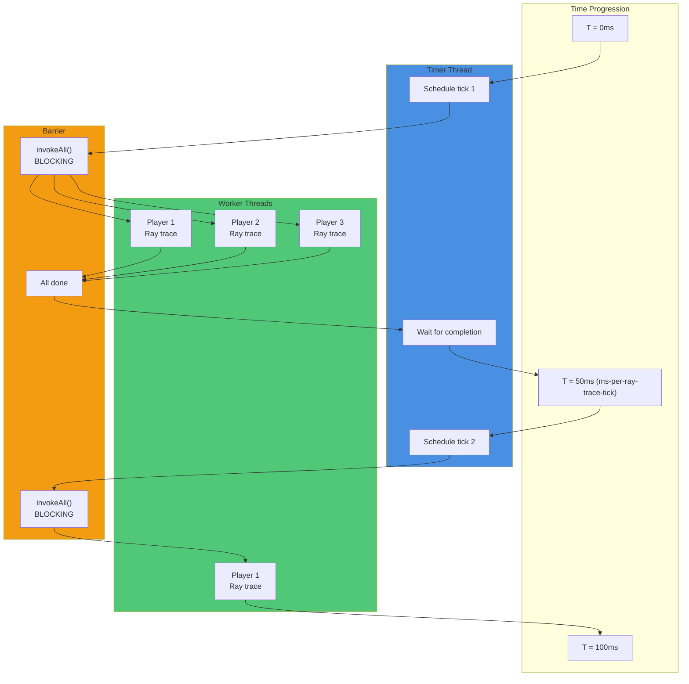
```mermaid
graph TB
    subgraph Timeline["Time Progression"]
        direction TB
        T1["T = 0ms"]
        T2["T = 50ms (ms-per-ray-trace-tick)"]
        T3["T = 100ms"]
    end
    
    subgraph Timer["Timer Thread"]
        direction TB
        TS1["Schedule tick 1"]
        TS2["Wait for completion"]
        TS3["Schedule tick 2"]
    end
    
    subgraph Workers["Worker Threads"]
        direction TB
        W1["Player 1<br/>Ray trace"]
        W2["Player 2<br/>Ray trace"]
        W3["Player 3<br/>Ray trace"]
        W4["Player 1<br/>Ray trace"]
    end
    
    subgraph Synchronization["Barrier"]
        direction TB
        Barrier1["invokeAll()<br/>BLOCKING"]
        Complete1["All done"]
        Barrier2["invokeAll()<br/>BLOCKING"]
    end
    
    T1 --> TS1
    TS1 --> Barrier1
    Barrier1 --> W1
    Barrier1 --> W2
    Barrier1 --> W3
    
    W1 --> Complete1
    W2 --> Complete1
    W3 --> Complete1
    
    Complete1 --> TS2
    TS2 --> T2
    T2 --> TS3
    TS3 --> Barrier2
    
    Barrier2 --> W4
    W4 --> T3
    
    style Synchronization fill:#f39c12
    style Timer fill:#4a90e2
    style Workers fill:#50c878
```

---

## Error Handling & Cleanup Flow

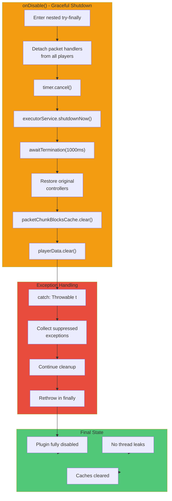
```mermaid
graph TB
    subgraph OnDisable["onDisable() - Graceful Shutdown"]
        direction TB
        Start["Enter nested try-finally"]
        RemoveHandlers["Detach packet handlers<br/>from all players"]
        CancelTimer["timer.cancel()"]
        ShutdownExecutor["executorService.shutdownNow()"]
        AwaitTermination["awaitTermination(1000ms)"]
        UnloadWorlds["Restore original<br/>controllers"]
        ClearCaches["packetChunkBlocksCache.clear()"]
        ClearPlayerData["playerData.clear()"]
    end
    
    subgraph ErrorHandling["Exception Handling"]
        direction TB
        Catch1["catch: Throwable t"]
        Collect["Collect suppressed<br/>exceptions"]
        Continue["Continue cleanup"]
        Rethrow["Rethrow in finally"]
    end
    
    subgraph Result["Final State"]
        direction TB
        Disabled["Plugin fully disabled"]
        NoLeak["No thread leaks"]
        NoCache["Caches cleared"]
    end
    
    Start --> RemoveHandlers
    RemoveHandlers --> CancelTimer
    CancelTimer --> ShutdownExecutor
    ShutdownExecutor --> AwaitTermination
    AwaitTermination --> UnloadWorlds
    UnloadWorlds --> ClearCaches
    ClearCaches --> ClearPlayerData
    
    ClearPlayerData --> Catch1
    Catch1 --> Collect
    Collect --> Continue
    Continue --> Rethrow
    
    Rethrow --> Disabled
    Disabled --> Result
    NoLeak --> Result
    NoCache --> Result
    
    style OnDisable fill:#f39c12
    style ErrorHandling fill:#e74c3c
    style Result fill:#50c878
```

---

## Cache Lifetime Management

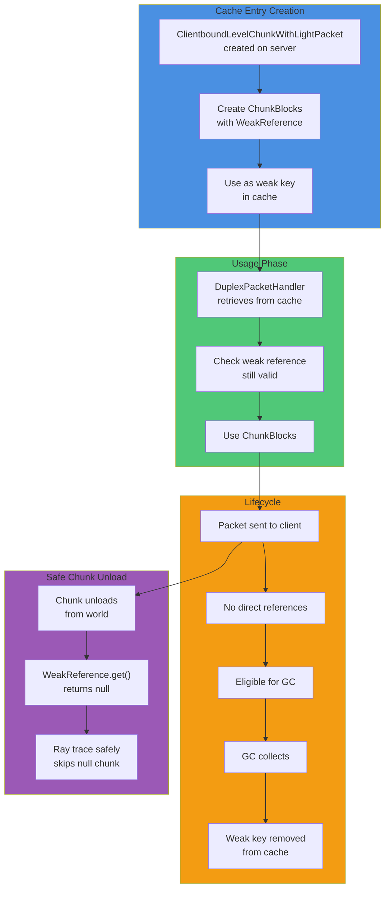
```mermaid
graph TB
    subgraph Creation["Cache Entry Creation"]
        direction TB
        ChunkPacket["ClientboundLevelChunkWithLightPacket<br/>created on server"]
        CreateChunkBlocks["Create ChunkBlocks<br/>with WeakReference"]
        WeakKey["Use as weak key<br/>in cache"]
    end
    
    subgraph Usage["Usage Phase"]
        direction TB
        GetChunk["DuplexPacketHandler<br/>retrieves from cache"]
        CheckRef["Check weak reference<br/>still valid"]
        Use["Use ChunkBlocks"]
    end
    
    subgraph Lifecycle["Lifecycle"]
        direction TB
        PacketSent["Packet sent to client"]
        NoMoreRef["No direct references"]
        GCEligible["Eligible for GC"]
        GCCollect["GC collects"]
        AutoRemove["Weak key removed<br/>from cache"]
    end
    
    subgraph SafeUnload["Safe Chunk Unload"]
        direction TB
        ChunkGone["Chunk unloads<br/>from world"]
        WeakRefNull["WeakReference.get()<br/>returns null"]
        SafeSkip["Ray trace safely<br/>skips null chunk"]
    end
    
    ChunkPacket --> CreateChunkBlocks
    CreateChunkBlocks --> WeakKey
    
    WeakKey --> GetChunk
    GetChunk --> CheckRef
    CheckRef --> Use
    
    Use --> PacketSent
    PacketSent --> NoMoreRef
    NoMoreRef --> GCEligible
    GCEligible --> GCCollect
    GCCollect --> AutoRemove
    
    PacketSent --> ChunkGone
    ChunkGone --> WeakRefNull
    WeakRefNull --> SafeSkip
    
    style Creation fill:#4a90e2
    style Usage fill:#50c878
    style Lifecycle fill:#f39c12
    style SafeUnload fill:#9b59b6
```

---

## Command Execution Flow

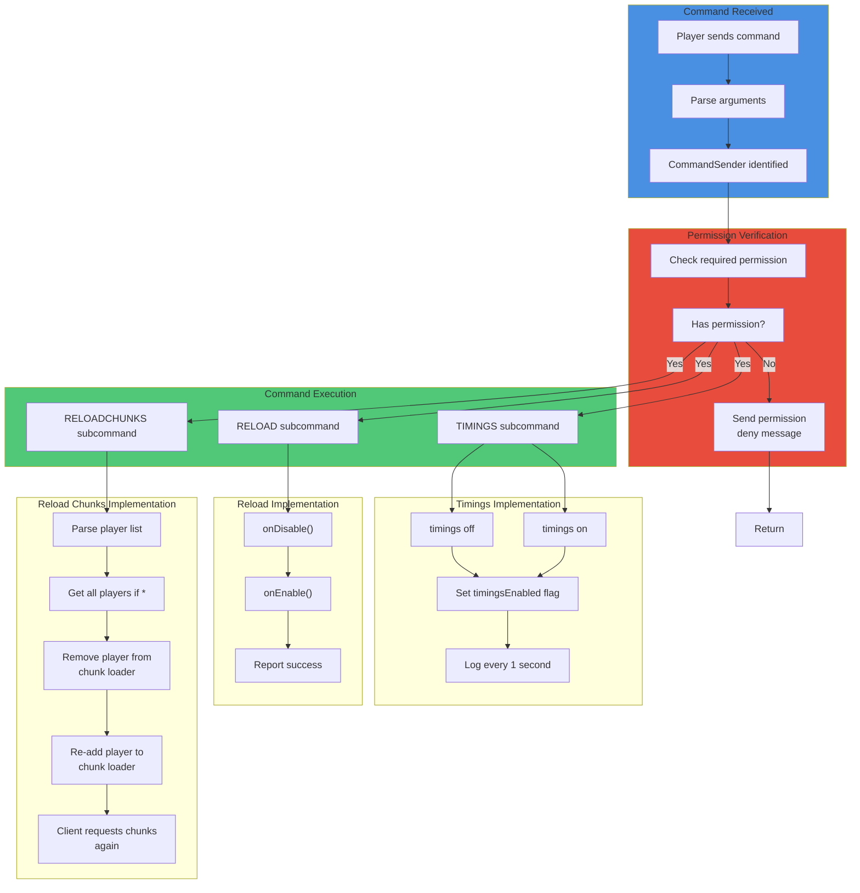
```mermaid
graph TB
    subgraph CommandReceive["Command Received"]
        direction TB
        Player["Player sends command"]
        Parse["Parse arguments"]
        Sender["CommandSender identified"]
    end
    
    subgraph PermissionCheck["Permission Verification"]
        direction TB
        Perm["Check required permission"]
        HasPerm["Has permission?"]
        DenyMsg["Send permission<br/>deny message"]
    end
    
    subgraph Execution["Command Execution"]
        direction TB
        Timings["TIMINGS subcommand"]
        Reload["RELOAD subcommand"]
        ReloadChunks["RELOADCHUNKS subcommand"]
    end
    
    subgraph TimingsImpl["Timings Implementation"]
        direction TB
        On["timings on"]
        Off["timings off"]
        SetFlag["Set timingsEnabled flag"]
        Log["Log every 1 second"]
    end
    
    subgraph ReloadImpl["Reload Implementation"]
        direction TB
        CallDisable["onDisable()"]
        CallEnable["onEnable()"]
        Success["Report success"]
    end
    
    subgraph ReloadChunksImpl["Reload Chunks Implementation"]
        direction TB
        GetPlayers["Parse player list"]
        GetAll["Get all players if *"]
        RemoveChunks["Remove player from<br/>chunk loader"]
        AddChunks["Re-add player to<br/>chunk loader"]
        Requesteer["Client requests chunks<br/>again"]
    end
    
    Player --> Parse
    Parse --> Sender
    Sender --> Perm
    Perm --> HasPerm
    
    HasPerm -->|No| DenyMsg
    DenyMsg --> End1["Return"]
    
    HasPerm -->|Yes| Timings
    HasPerm -->|Yes| Reload
    HasPerm -->|Yes| ReloadChunks
    
    Timings --> On
    Timings --> Off
    On --> SetFlag
    Off --> SetFlag
    SetFlag --> Log
    
    Reload --> CallDisable
    CallDisable --> CallEnable
    CallEnable --> Success
    
    ReloadChunks --> GetPlayers
    GetPlayers --> GetAll
    GetAll --> RemoveChunks
    RemoveChunks --> AddChunks
    AddChunks --> Requesteer
    
    style CommandReceive fill:#4a90e2
    style PermissionCheck fill:#e74c3c
    style Execution fill:#50c878
```

